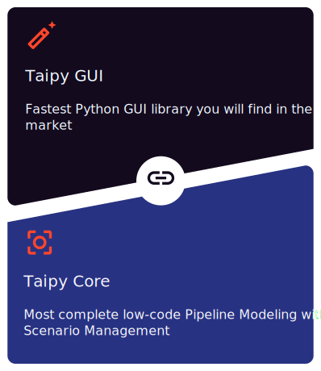
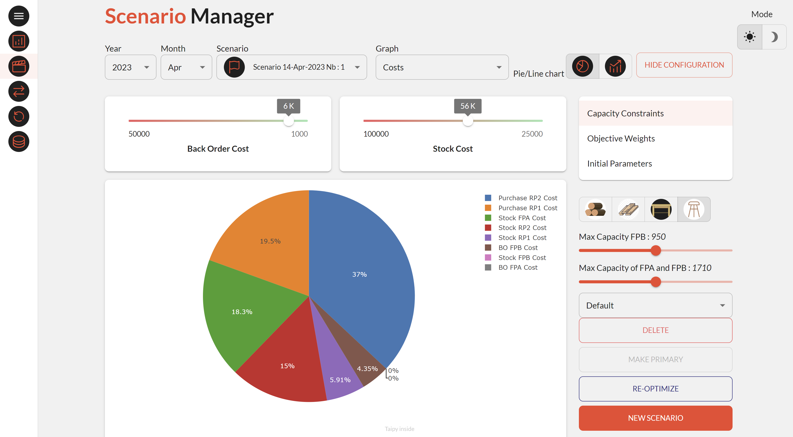

# What is Taipy?

Taipy is an innovative **low-code** package to create complete applications in *Python*. It is composed of two independent components: a **Graphical User Interface** and a **Scenario Management** part.

  

The **Graphical User Interface** of Taipy allows anyone with basic knowledge of Python to create a beautiful and interactive interface. It is a simple and intuitive way to create a GUI. No need to know how to design web pages with CSS or HTML; Taipy uses an augmented syntax of Markdown to create your desired web page.

    

The **Scenario Management** component of Taipy is a powerful tool to manage business problems and pipelines. The implementation of **Taipy Core** is straightforward. For example, it will allow you to:
- Keep track of your KPI, data, scenarios, pipelines, etc.
- Have smart scheduling
- Simplify industrialization for DataViz, Machine-Learning, Optimization, etc.

You can use the GUI component without the Scenario Management and vice-versa. However, as you will see, they are incredibly efficient when combined.

This **'Getting Started'** will go through all the basic concepts of *Taipy* to create a complete application. Each step is based on the code of the previous one. At the end of it, you will be able to create a complete application using *Taipy*. So, without further delay, let's begin to code!

## Steps:
> Packages needed: *taipy*, *scikit-learn*, *statsmodels*

0. [First web page](https://docs.taipy.io/getting_started/step_00/ReadMe/)

1. [Introducing Taipy visual elements](https://docs.taipy.io/getting_started/step_01/ReadMe/)

2. [Creating an interactive GUI](https://docs.taipy.io/getting_started/step_02/ReadMe/)

3. [Introducing Taipy Core](https://docs.taipy.io/getting_started/step_03/ReadMe/)

4. [Pipeline Management](https://docs.taipy.io/getting_started/step_04/ReadMe/)

5. [Building the GUI for a pipeline and buttons](https://docs.taipy.io/getting_started/step_05/ReadMe/)

6. [Creation and execution of Scenarios](https://docs.taipy.io/getting_started/step_06/ReadMe/)

7. [Building the GUI for a scenario and selectors](https://docs.taipy.io/getting_started/step_07/ReadMe/)

8. [How to write data and change your default parameters?](https://docs.taipy.io/getting_started/step_08/ReadMe/)

9. [GUI for multi-scenarios](https://docs.taipy.io/getting_started/step_09/ReadMe/)

10. [Make your application beautiful](https://docs.taipy.io/getting_started/step_10/ReadMe/)

11. [Introducing cycles](https://docs.taipy.io/getting_started/step_11/ReadMe/)

12. [Compare primary scenarios](https://docs.taipy.io/getting_started/step_12/ReadMe/)

