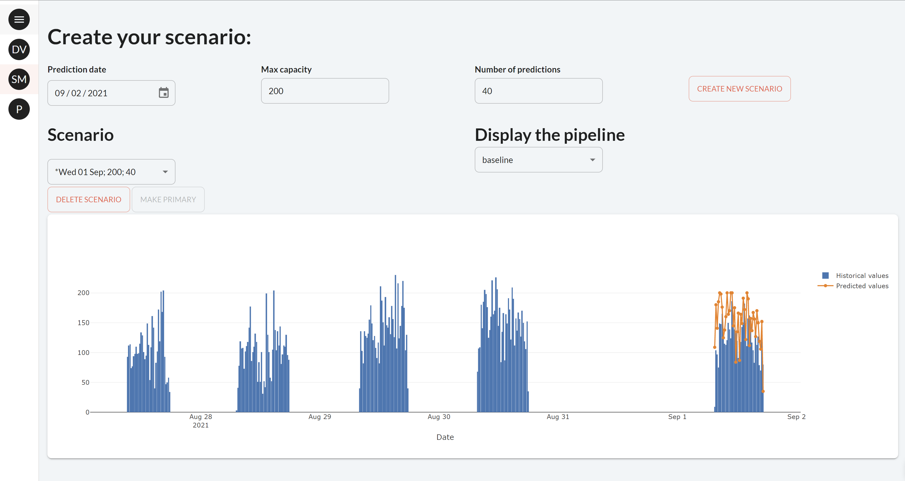

# Getting Started with Taipy

!!! important "Supported Python versions"

    Taipy requires **Python 3.8** or newer.

Welcome to the **Getting Started** guide for Taipy. This tour shows you how to create an entire application using 
the two components of Taipy:

- **Graphical User Interface builder** (Taipy GUI): allows any Python developer to create a complex and interactive GUI.

- **Scenario Management** (Taipy Core): implements a modern backend for any data-driven application based on your business case.

{ width=700 style="margin:auto;display:block;border: 4px solid rgb(210,210,210);border-radius:7px" }


You can use Taipy GUI without Taipy Core and vice-versa. However, as you will see, they are incredibly efficient 
when combined.

Each step of the **"Getting Started"** will focus on basic concepts of *Taipy*. Note that every step is dependent on 
the code of the previous one. After completing the last step, you will have the skills to develop your own Taipy 
application. 

## Before we begin

Three packages have to be installed:

 1. **Taipy** package, it requires Python 3.8 or newer;

 2. **scikit-learn**: A Machine-Learning package that will be used in the Getting Started user code;

 3. **statsmodels**: Another package for statistics also used in the user code.

``` console
$ pip install taipy
$ pip install scikit-learn
$ pip install statsmodels
```

!!! info 

    `pip install taipy` is the preferred method to install the latest stable version of Taipy.
    
    If you don't have [pip](https://pip.pypa.io) installed, this 
    [Python installation guide](http://docs.python-guide.org/en/latest/starting/installation/)
    can guide you through the process.

## Using Notebooks

This **Getting Started** is for Python scripts (*.py*) only. If you want to use **Jupyter Notebooks**, download this [notebook](https://docs.taipy.io/en/latest/getting_started/getting-started/getting_started.ipynb).

So, without further delay, let's begin to code!

## Steps

0. [First web page](step_00/ReadMe.md)

1. [Visual elements](step_01/ReadMe.md)

2. [Interactive GUI](step_02/ReadMe.md)

3. [Introducing Taipy Core](step_03/ReadMe.md)

4. [Pipeline Management](step_04/ReadMe.md)

5. [GUI & Pipeline](step_05/ReadMe.md)

6. [Creation of Scenarios](step_06/ReadMe.md)

7. [GUI & Scenarios](step_07/ReadMe.md)

8. [Modify Data Nodes content](step_08/ReadMe.md)

9. [Manage Scenarios](step_09/ReadMe.md)

10. [Embellish your APP](step_10/ReadMe.md)

11. [Introducing Cycles](step_11/ReadMe.md)

12. [Compare Scenarios](step_12/ReadMe.md)
