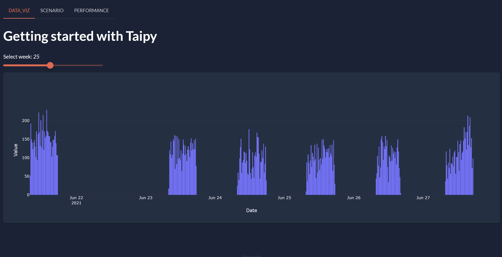

# Getting Started with Taipy

!!! important "Supported Python versions"

    Taipy requires **Python 3.8** or newer.

Welcome to the **Getting Started** guide for Taipy. This tour shows you how to create an entire application using 
the two components of Taipy:

- **Graphical User Interface builder** (Taipy GUI): allows any Python developer to create a complex and interactive GUI.

- **Scenario Management** (Taipy Core): implements a modern backend for any data-driven application based on your business case.

{ width=700 style="margin:auto;display:block;border: 4px solid rgb(210,210,210);border-radius:7px" }


You can use Taipy GUI without Taipy Core and vice-versa. However, as you will see, they are incredibly efficient when combined.

Each step of the **"Getting Started"** focus on basic concepts of *Taipy*. Each file needed are created by steps. Note that every step creates a . After completing the last step, you will have a complete multi-page application.

## Before we begin

Three packages have to be installed:

 1. **Taipy** package, it requires Python 3.8 or newer;

 2. **scikit-learn**: A Machine-Learning package that will be used in the Getting Started user code;

 3. **statsmodels**: Another package for statistics also used in the user code.

``` console
$ pip install taipy
$ pip install scikit-learn
$ pip install statsmodels
```

!!! info 

    `pip install taipy` is the preferred method to install the latest stable version of Taipy.
    
    If you don't have [pip](https://pip.pypa.io) installed, this 
    [Python installation guide](http://docs.python-guide.org/en/latest/starting/installation/)
    can guide you through the process.


Once Taipy is installed, you can use the CLI to create the scaffolding. The default template will be used throughout the creation of the application.

``` console
> taipy create --template default
Application root folder name [taipy_application]:
Application main Python file [main.py]:
Application title [Taipy Application]:
Page names in multi-page application? []: data_viz scenario performance
Does the application use scenario management or version management? [No]: yes
Does the application use Rest API? [No]: no
```


So, without further delay, let's begin to code!

## Steps

1. [Data Visualization page](step_01/ReadMe.md)

2. [Algorithms used](step_02/ReadMe.md)

3. [Backend Configuration](step_03/ReadMe.md)

4. [Scenario page](step_04/ReadMe.md)

5. [Performance page](step_05/ReadMe.md)