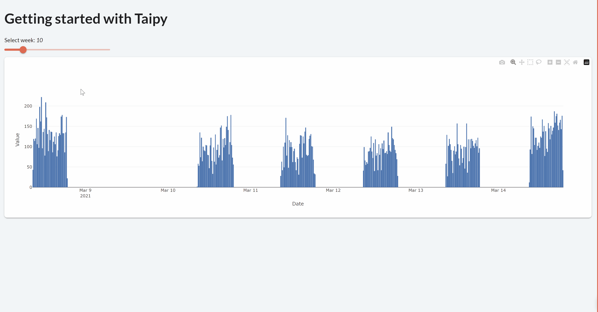

> You can download the full code [here](https://github.com/Avaiga/taipy-getting-started/tree/develop/src).

# Data Visualization page

The first page of the application is about visualizing the data.

## Importing the Dataset

Suppose that you have a [*dataset.csv*](dataset.csv) file, using the *Pandas* library, you can retrieve this dataset 
with the following code:

```python
import pandas as pd

def get_data(path_to_csv: str):
    # pandas.read_csv() returns a pd.DataFrame
    dataset = pd.read_csv(path_to_csv)
    dataset["Date"] = pd.to_datetime(dataset["Date"])
    return dataset

# Read the dataframe
path_to_csv = "dataset.csv"
dataset = get_data(path_to_csv)
```

_dataset_ is a *pd.DataFrame*, a basic *Pandas main* object representing, in this case, a realistic time series. 
It represents the historical number of articles sold for a given store on a 15-minute basis (we have the historical 
sales data for the year 2021). The columns are:

- Index: a unique identifier for each data point.

- Date: the date of the data point. Each date are separated by 15 minutes.

- Value: the number of articles sold per 15-minute timeframe.

{ width=700 style="margin:auto;display:block;border: 2px solid rgb(210,210,210);border-radius:7px" }

## Visual elements

Taipy GUI can be considered as an **augmented** Markdown; it adds the concept of 
**[Visual elements](https://docs.taipy.io/en/latest/manuals/gui/viselements/)** on top of all the Markdown syntax. A visual 
element is a Taipy graphical object displayed on the client. It can be a 
[slider](https://docs.taipy.io/en/latest/manuals/gui/viselements/slider/), a 
[chart](https://docs.taipy.io/en/latest/manuals/gui/viselements/chart/), a 
[table](https://docs.taipy.io/en/latest/manuals/gui/viselements/table/), an 
[input](https://docs.taipy.io/en/latest/manuals/gui/viselements/input/), a 
[menu](https://docs.taipy.io/en/latest/manuals/gui/viselements/menu/), etc. Check the list 
[here](https://docs.taipy.io/en/latest/manuals/gui/controls/).

Every visual element follows a similar syntax:

`<|{variable}|visual_element_name|param_1=param_1|param_2=param_2| ... |>`.

For example, a [slider](https://docs.taipy.io/en/latest/manuals/gui/viselements/slider/) is written this way :

`<|{variable}|slider|min=min_value|max=max_value|>`.

For each visual element you wish to add to your web page, you must include the syntax above inside your markdown 
string (representing your page). For example, at the beginning of the page, let's display:

- a Python variable *n_week*;

- a slider that will "visually" modify the value of __n_week__.

- a chart displaying our data.

Here is the overall syntax:

```
*<|{n_week}|>*
<|{n_week}|slider|min=1|max=52|>

<|{dataset}|chart|type=bar|x=Date|y=Value|>
```


## Interactive GUI

The page has several visual elements:

- A slider that is connected to the Python variable *n_week* ;

- A chart that represent the DataFrame content.


## Multi-client - state

The state holds the value of all the variables that are used in the user interface, for one specific connection.

For example, at the beginning, `state.n_week = 10`. When *n_week* is modified by the slider (through a given graphical client), this is, in fact, *state.n_week* that is modified, not *n_week* (the global Python variable). Therefore, if you open 2 different clients, *n_week* will have 2 state values (*state.n_week*), one for each client.

In the code below, this concept will be used to connect a variable (*n_week*) to other variables:

- We will create a chart that will only display one week of data corresponding to the selected week of the slider.

- A connection has to be made between the slider's value  (*state.n_week*) and the chart data (*state.dataset_week*).

## How to connect two variables - the *[on_change](https://docs.taipy.io/en/latest/manuals/gui/callbacks/)* function

In *Taipy*, the `on_change()` function is a "special" function. **Taipy** will check if you created a function with this name and will use it. Whenever the state of a variable is modified, the *callback* function is called with three parameters:

- state (the state object containing all the variables)

- The name of the modified variable

- Its value.

Here, `on_change()` will be called whenever the slider's value (*state.n_week*) changes. Each time this happens, *state.dataset_week* will be updated according to the new value of the selected week. Then, Taipy will propagate this change automatically to the associated chart.

## Markdown

```
# Getting started with Taipy

Select week: *<|{n_week}|>*

<|{n_week}|slider|min=1|max=52|on_change=on_slider|>

<|{dataset_week}|chart|type=bar|x=Date|y=Value|>
```

## Python code

```python
from taipy.gui import Markdown
import pandas as pd

def get_data(path_to_csv: str):
    # pandas.read_csv() returns a pd.DataFrame
    dataset = pd.read_csv(path_to_csv)
    dataset["Date"] = pd.to_datetime(dataset["Date"])
    return dataset

# Read the dataframe
path_to_csv = "data/dataset.csv"
dataset = get_data(path_to_csv)

# Initial value
n_week = 10

# Select the week based on the slider value
dataset_week = dataset[dataset["Date"].dt.isocalendar().week == n_week]

def on_slider(state):
    state.dataset_week = dataset[dataset["Date"].dt.isocalendar().week == state.n_week]


data_viz = Markdown("pages/data_viz/data_viz.md")
```

{ width=700 style="margin:auto;display:block;border: 4px solid rgb(210,210,210);border-radius:7px" }
