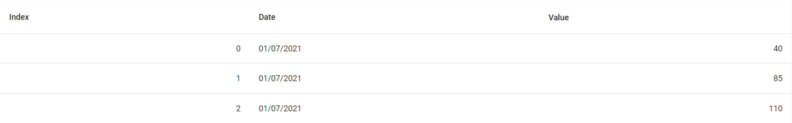
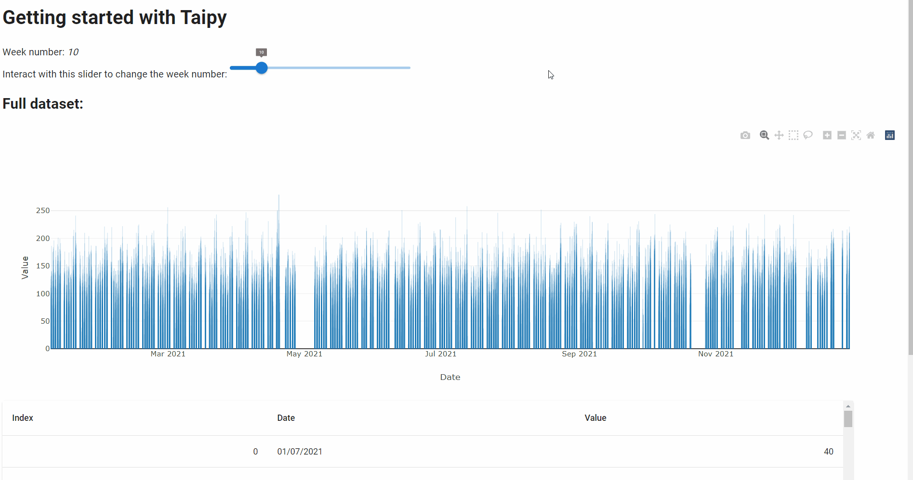

> You can download the code of this step [here](../src/step_01.py) or all the steps [here](https://github.com/Avaiga/taipy-getting-started/tree/develop/src).

!!! warning "For Notebooks"

    The "Getting Started" Notebook is available [here](https://docs.taipy.io/en/latest/getting_started/getting-started/getting_started.ipynb).

# Step 1: Visual elements

Many visual elements can be added to the basic code viewed in Step 0. This Step shows how to use visual elements 
like charts, sliders and tables and implement them in the GUI.

## Importing the Dataset

Suppose that you have a [*dataset.csv*](dataset.csv) file, using the *Pandas* library, you can retrieve this dataset 
with the following code:

```python
import pandas as pd

def get_data(path_to_csv: str):
    # pandas.read_csv() returns a pd.DataFrame
    dataset = pd.read_csv(path_to_csv)
    dataset["Date"] = pd.to_datetime(dataset["Date"])
    return dataset

# Read the dataframe
path_to_csv = "dataset.csv"
dataset = get_data(path_to_csv)

...
```

_dataset_ is a *pd.DataFrame*, a basic *Pandas main* object representing, in this case, a realistic time series. 
It represents the historical number of articles sold for a given store on a 15-minute basis (we have the historical 
sales data for the year 2021). Being a real dataset, there will sometimes be missing information for specific days. 
The columns are:

- Index: a unique identifier for each data point.

- Date: the date of the data point. Each date are separated by 15 minutes.

- Value: the number of articles sold per 15-minute timeframe.

{ width=700 style="margin:auto;display:block;border: 2px solid rgb(210,210,210);border-radius:7px" }

After creating your first web client with just one line of code and reading our dataset data with the code above, 
let's add some  visual elements to our initial page.

## Visual elements

Taipy GUI can be considered as an **augmented** Markdown; it adds the concept of 
**[Visual elements](https://docs.taipy.io/en/latest/manuals/gui/viselements/)** on top of all the Markdown syntax. A visual 
element is a Taipy graphical object displayed on the client. It can be a 
[slider](https://docs.taipy.io/en/latest/manuals/gui/viselements/slider/), a 
[chart](https://docs.taipy.io/en/latest/manuals/gui/viselements/chart/), a 
[table](https://docs.taipy.io/en/latest/manuals/gui/viselements/table/), an 
[input](https://docs.taipy.io/en/latest/manuals/gui/viselements/input/), a 
[menu](https://docs.taipy.io/en/latest/manuals/gui/viselements/menu/), etc. Check the list 
[here](https://docs.taipy.io/en/latest/manuals/gui/controls/).

Every visual element follows a similar syntax:

`<|{variable}|visual_element_name|param_1=param_1|param_2=param_2| ... |>`.

For example, a [slider](https://docs.taipy.io/en/latest/manuals/gui/viselements/slider/) is written this way :

`<|{variable}|slider|min=min_value|max=max_value|>`.

For each visual element you wish to add to your web page, you must include the syntax above inside your markdown 
string (representing your page). For example, at the beginning of the page, let's display:

- a Python variable *n_week*;

- a slider that will "visually" modify the value of __n_week__.

Here is the overall syntax:

```
*<|{n_week}|>*
<|{n_week}|slider|min=1|max=52|>
```

We will then create a chart and a table:

```
<|{dataset}|chart|type=bar|x=Date|y=Value|height=100%|>
<|{dataset}|table|height=400px|width=95%|>
```

Here is the combined code:

```python
...

from taipy import Gui

dataset = get_data(path_to_csv)

# Initial value
n_week = 10

# Definition of the page
page = """
# Getting started with Taipy

Week number: *<|{n_week}|>*

Interact with this slider to change the week number:
<|{n_week}|slider|min=1|max=52|>

## Dataset:

Display the last three months of data:
<|{dataset[9000:]}|chart|type=bar|x=Date|y=Value|height=100%|>

<|{dataset}|table|height=400px|width=95%|>
"""

# Create a Gui object with our page content
Gui(page=page).run(dark_mode=False)
```

{ width=700 style="margin:auto;display:block;border: 4px solid rgb(210,210,210);border-radius:7px" }
