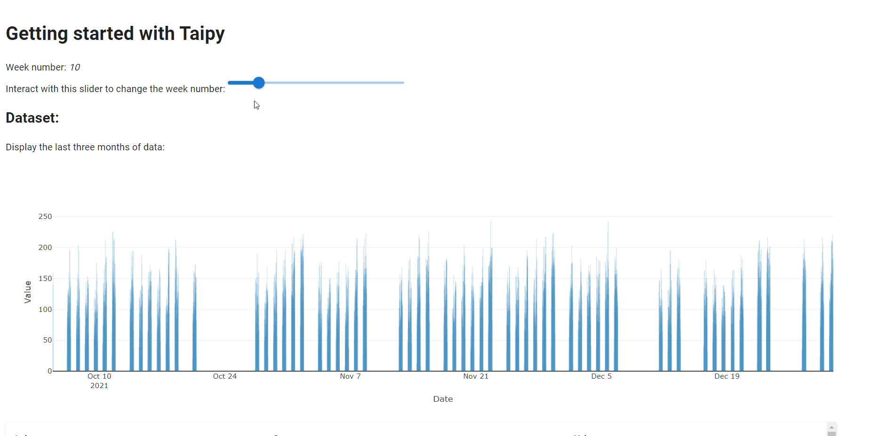

> You can download the full code [here](https://github.com/Avaiga/taipy-getting-started/tree/develop/src).

# Step 1: Visual elements

Many visual elements can be added to the basic code viewed in Step 0. This Step shows how to use visual elements 
like charts, sliders and tables and implement them in the GUI.

## Importing the Dataset

Suppose that you have a [*dataset.csv*](dataset.csv) file, using the *Pandas* library, you can retrieve this dataset 
with the following code:

```python
import pandas as pd

def get_data(path_to_csv: str):
    # pandas.read_csv() returns a pd.DataFrame
    dataset = pd.read_csv(path_to_csv)
    dataset["Date"] = pd.to_datetime(dataset["Date"])
    return dataset

# Read the dataframe
path_to_csv = "dataset.csv"
dataset = get_data(path_to_csv)

...
```

_dataset_ is a *pd.DataFrame*, a basic *Pandas main* object representing, in this case, a realistic time series. 
It represents the historical number of articles sold for a given store on a 15-minute basis (we have the historical 
sales data for the year 2021). Being a real dataset, there will sometimes be missing information for specific days. 
The columns are:

- Index: a unique identifier for each data point.

- Date: the date of the data point. Each date are separated by 15 minutes.

- Value: the number of articles sold per 15-minute timeframe.

{ width=700 style="margin:auto;display:block;border: 2px solid rgb(210,210,210);border-radius:7px" }

After creating your first web client with just one line of code and reading our dataset data with the code above, 
let's add some  visual elements to our initial page.

## Visual elements

Taipy GUI can be considered as an **augmented** Markdown; it adds the concept of 
**[Visual elements](https://docs.taipy.io/en/latest/manuals/gui/viselements/)** on top of all the Markdown syntax. A visual 
element is a Taipy graphical object displayed on the client. It can be a 
[slider](https://docs.taipy.io/en/latest/manuals/gui/viselements/slider/), a 
[chart](https://docs.taipy.io/en/latest/manuals/gui/viselements/chart/), a 
[table](https://docs.taipy.io/en/latest/manuals/gui/viselements/table/), an 
[input](https://docs.taipy.io/en/latest/manuals/gui/viselements/input/), a 
[menu](https://docs.taipy.io/en/latest/manuals/gui/viselements/menu/), etc. Check the list 
[here](https://docs.taipy.io/en/latest/manuals/gui/controls/).

Every visual element follows a similar syntax:

`<|{variable}|visual_element_name|param_1=param_1|param_2=param_2| ... |>`.

For example, a [slider](https://docs.taipy.io/en/latest/manuals/gui/viselements/slider/) is written this way :

`<|{variable}|slider|min=min_value|max=max_value|>`.

For each visual element you wish to add to your web page, you must include the syntax above inside your markdown 
string (representing your page). For example, at the beginning of the page, let's display:

- a Python variable *n_week*;

- a slider that will "visually" modify the value of __n_week__.

Here is the overall syntax:

```
*<|{n_week}|>*
<|{n_week}|slider|min=1|max=52|>
```

We will then create a chart and a table:

```
<|{dataset}|chart|type=bar|x=Date|y=Value|>
<|{dataset}|table|>
```


# Step 2: Interactive GUI

Now, the page has several visual elements:

- A slider that is connected to the Python variable *n_week* ;

- A chart and a table controls that represent the DataFrame content.

Taipy GUI manages everything. To go further into Taipy GUI, let's consider the concept of **state**.

## Multi-client - state

Try to open a few clients with the same URL. You will see that every client is independent from each other; you can change *n_week* on a client, and *n_week* will not change in other clients. This is due to the concept of **state**.

The state holds the value of all the variables that are used in the user interface, for one specific connection.

For example, at the beginning, `state.n_week = 10`. When *n_week* is modified by the slider (through a given graphical client), this is, in fact, *state.n_week* that is modified, not *n_week* (the global Python variable). Therefore, if you open 2 different clients, *n_week* will have 2 state values (*state.n_week*), one for each client.

In the code below, this concept will be used to connect a variable (*n_week*) to other variables:

- We will create a chart that will only display one week of data corresponding to the selected week of the slider.

- A connection has to be made between the slider's value  (*state.n_week*) and the chart data (*state.dataset_week*).

## How to connect two variables - the *[on_change](https://docs.taipy.io/en/latest/manuals/gui/callbacks/)* function

In *Taipy*, the `on_change()` function is a "special" function. **Taipy** will check if you created a function with this name and will use it. Whenever the state of a variable is modified, the *callback* function is called with three parameters:

- state (the state object containing all the variables)

- The name of the modified variable

- Its value.

Here, `on_change()` will be called whenever the slider's value (*state.n_week*) changes. Each time this happens, *state.dataset_week* will be updated according to the new value of the selected week. Then, Taipy will propagate this change automatically to the associated chart.

```python
from taipy import Gui

dataset = get_data(path_to_csv)

# Initial value
n_week = 10

# Select the week based on the slider value
dataset_week = dataset[dataset["Date"].dt.isocalendar().week == n_week]

page = """
# Getting started with Taipy

Select week: *<|{n_week}|>*

<|{n_week}|slider|min=1|max=52|>

<|{dataset_week}|chart|type=bar|x=Date|y=Value|>
"""

# on_change is the function that is called when any variable is changed
def on_change(state, var_name: str, var_value):
    if var_name == "n_week":
        # Update the dataset when the slider is moved
        state.dataset_week = dataset[dataset["Date"].dt.isocalendar().week == var_value]

Gui(page=page).run(dark_mode=False)
```

{ width=700 style="margin:auto;display:block;border: 4px solid rgb(210,210,210);border-radius:7px" }

{ width=700 style="margin:auto;display:block;border: 4px solid rgb(210,210,210);border-radius:7px" }
