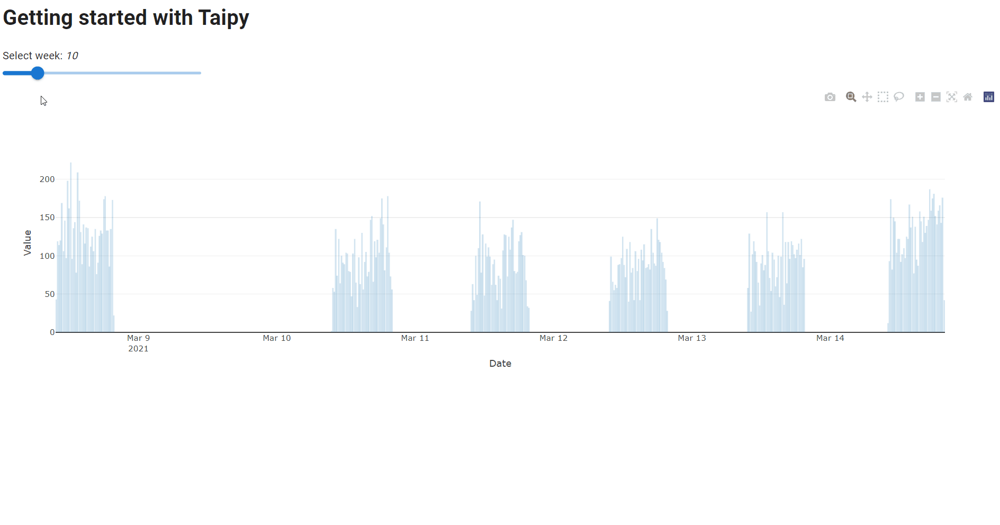

> You can download the code of this step [here](../src/step_02.py) or all the steps [here](https://github.com/Avaiga/taipy-getting-started/tree/develop/src).

!!! warning "For Notebooks"

    The "Getting Started" Notebook is available [here](https://docs.taipy.io/en/latest/getting_started/getting_started.ipynb). In Taipy GUI, the process to execute a Jupyter Notebook is different from executing a Python Script.
    It is important to check the [Notebook](https://docs.taipy.io/en/latest/getting_started/getting_started.ipynb) content and see the [documentation](https://docs.taipy.io/en/latest/manuals/gui/notebooks/).

# Step 2: Interactive GUI

Now, the page has several visual elements:

- A slider that is connected to the Python variable *n_week* ;

- A chart and a table controls that represent the DataFrame content.

Taipy GUI manages everything. To go further into Taipy GUI, let's consider the concept of **state**.

## Multi-client - state

Try to open a few clients with the same URL. You will see that every client is independent from each other; you can change *n_week* on a client, and *n_week* will not change in other clients. This is due to the concept of **state**.

The state holds the value of all the variables that are used in the user interface, for one specific connection.

For example, at the beginning, `state.n_week = 10`. When *n_week* is modified by the slider (through a given graphical client), this is, in fact, *state.n_week* that is modified, not *n_week* (the global Python variable). Therefore, if you open 2 different clients, *n_week* will have 2 state values (*state.n_week*), one for each client.

In the code below, this concept will be used to connect a variable (*n_week*) to other variables:

- We will create a chart that will only display one week of data corresponding to the selected week of the slider.

- A connection has to be made between the slider's value  (*state.n_week*) and the chart data (*state.dataset_week*).

## How to connect two variables - the *[on_change](https://docs.taipy.io/en/latest/manuals/gui/callbacks/)* function

In *Taipy*, the `on_change()` function is a "special" function. **Taipy** will check if you created a function with this name and will use it. Whenever the state of a variable is modified, the *callback* function is called with three parameters:

- state (the state object containing all the variables)

- The name of the modified variable

- Its value.

Here, `on_change()` will be called whenever the slider's value (*state.n_week*) changes. Each time this happens, *state.dataset_week* will be updated according to the new value of the selected week. Then, Taipy will propagate this change automatically to the associated chart.

```python
# Select the week based on the slider value
dataset_week = dataset[dataset["Date"].dt.isocalendar().week == n_week]

page = """
# Getting started with Taipy

Select week: *<|{n_week}|>*

<|{n_week}|slider|min=1|max=52|>

<|{dataset_week}|chart|type=bar|x=Date|y=Value|height=100%|width=100%|>
"""

# on_change is the function that is called when any variable is changed
def on_change(state, var_name: str, var_value):
    if var_name == "n_week":
        # Update the dataset when the slider is moved
        state.dataset_week = dataset[dataset["Date"].dt.isocalendar().week == var_value]

Gui(page=page).run(dark_mode=False)
```

{ width=700 style="margin:auto;display:block;border: 4px solid rgb(210,210,210);border-radius:7px" }

