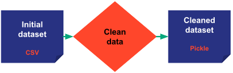

> You can download the code of this step [here](../src/step_03.py).

# Introducing Taipy Core

From Step 2, you now know the basics of Taipy GUI. Let's go for a moment to the Scenario Management aspect of Taipy.

There are a lot of reasons to use Taipy Core.
- Efficiently manage the execution of your functions
- Keep track of data and KPIs.
- Handy to manage multiple pipelines in the context of Machine Learning or Mathematical optimization.

Taipy allows you to manage them effortlessly. To apprehend the Scenario Management aspect of Taipy, you need to understand four essential concepts.

## Four fundamental [concepts](https://didactic-broccoli-7da2dfd5.pages.github.io/manuals/core/concepts/) in Taipy Core:
- [**Data Nodes**](https://didactic-broccoli-7da2dfd5.pages.github.io/manuals/core/concepts/data-node/): are the translation of variables in Taipy. They don't contain the data itself but know how to retrieve it. It can refer to any data: any *Python* object (*string*, *int*, *list*, *dict*, *model*, *dataframe*, etc), Pickle, CSV file, or even SQL database. They know how to read and write data. You can even write your own custom Data Node if needed to access a particular data.
- [**Tasks**](https://didactic-broccoli-7da2dfd5.pages.github.io/manuals/core/concepts/task/): are the translation of functions in Taipy.
- [**Pipelines**](https://didactic-broccoli-7da2dfd5.pages.github.io/manuals/core/concepts/pipeline/): are a list of tasks executed with intelligent scheduling created automatically by Taipy. They usually represent a series of functions for different algorithms like a baseline or Machine-Learning algorithm.
- [**Scenarios**](https://didactic-broccoli-7da2dfd5.pages.github.io/manuals/core/concepts/scenario/): are your business problem with some parameters. They usually consist of one or multiple pipelines.


Let's create a Machine Learning (ML) example to  answer any confusions that you may have. In a ML problem, it is common to have numerous training and testing pipelines for different algorithms.
For simplification, this step will only configure one baseline pipeline. Therefore, the goal is to create a Directed Acyclic Graph (DAG) that represents this pipeline. This single pipeline retrieves the initial dataset, cleans it, and gives predictions for the *day*.

<p align="center">
            
</p>


This graph is created by configuring Data Nodes (variables) and tasks (functions). This configuration doesn't execute anything; it is just a setup for the DAG.

# Data Nodes configuration

Data Nodes can point to any kind of *Python* variables by default: *int*, *string*, *dict*, *list*, *np.array*, *pd.DataFrame*, *models*, etc. Taipy also can read and write a CSV, Pickle file or SQL database through a Data Node. The Data Node configuration allows you to select the storage type of the Data Node.

Some parameters for Data Node configuration:
- **Storage_type**: This is where the storage type is selected: CSV file, SQL database, pickle file, etc.
            Here, the initial dataset is a CSV file so `storage_type="csv"` for this Data Node. Taipy knows how to access it, thanks to the path. By default, the storage type is `pickle`.

- **[Scope](https://didactic-broccoli-7da2dfd5.pages.github.io/manuals/core/concepts/scope/)**: You can find below two types of Scope in the code: the Pipeline and Scenario scope (by default).
            Basically, with Scenario scope, Data Nodes are shared between all the pipelines of the scenario.
            With Pipeline scope, Data Nodes are not shared between pipelines and don't have access to other Data Nodes from other pipelines. A 'predictions' Data Node is created for each pipeline in the current example. So, adding pipelines/algorithms will store predictions in different "predictions" Data Nodes.

- **Cacheable**: This is a parameter used to increase the efficiency of the program. If the Data Node has already been created and the inputs didn't change, it is not necessary to rerun it.


## Input Data Nodes configuration
These are the input Data Nodes. They represent the variables in Taipy when a pipeline is executed. Still, first, we have to configure them to create the DAG.

- *initial_dataset* is simply the initial CSV file. Taipy needs some parameters to read this data: *path* and *header*. 

- *day* is the beginning of the predictions. The default value is the 26th of July. It means the training data will end before the 26th of July, and predictions will begin on this day.

- *n_predictions* is the number of predictions you want to make while predicting. The default value is 40.

- *max_capacity* is the maximum value that can take a prediction; it is the ceiling of the projections. The default value is 200.

```python
import taipy as tp
from taipy import Scope
import datetime as dt

## Input Data Nodes
initial_dataset_cfg = tp.configure_data_node(id="initial_dataset",
                                             storage_type="csv",
                                             path=path_to_csv)

day_cfg = tp.configure_data_node(id="day", default_data=dt.datetime(2021, 7, 26))

n_predictions_cfg = tp.configure_data_node(id="n_predictions", default_data=40)

max_capacity_cfg = tp.configure_data_node(id="max_capacity", default_data=200)
```

 ## Remaining Data Nodes

- *cleaned_dataset* is the dataset after cleaning (after the *clean_data* function).

- *predictions* are the predictions of the model. In this pipeline, it will be the output of the *predict_baseline* function. Each pipeline will create its own *prediction* Data Node hence `scope=Scope.PIPELINE`. 

```python
## Remaining Data Nodes
cleaned_dataset_cfg = tp.configure_data_node(id="cleaned_dataset") # ,
                                                                   # cacheable=True,
                                                                   # validity_period=dt.timedelta(days=1)

predictions_cfg = tp.configure_data_node(id="predictions", scope=Scope.PIPELINE)
```


# Functions

Let's declare the functions: *clean_data* and *predict_baseline*. Their goal is respectively to clean the data and to predict the data.

```python
def clean_data(initial_dataset: pd.DataFrame):
    ...
    return cleaned_dataset


def predict_baseline(cleaned_dataset: pd.DataFrame, n_predictions: int, day: dt.datetime, max_capacity: int):
    ...
    predictions = predictions.apply(lambda x: min(x, max_capacity))
    return predictions
```

# Tasks

Tasks are the translation of functions in Taipy. These tasks combined with Data Nodes create your graph. Creating a task is simple; you need:
- An id
- A function
- Inputs
- Outputs

## clean_data_task

The first task that you want to create is your *clean_data* task. It will take your initial dataset and clean it.

<p align="center">
            
</p>

```python
clean_data_task_cfg = tp.configure_task(id="clean_data",
                                        function=clean_data,
                                        input=initial_dataset_cfg,
                                        output=cleaned_dataset_cfg)
```

## predict_baseline_task

This task will take the cleaned dataset and predict it according to your parameters.

<p align="center">
            
</p>

```python
predict_baseline_task_cfg = tp.configure_task(id="predict_baseline",
                                              function=predict_baseline,
                                              input=[cleaned_dataset_cfg, n_predictions_cfg, day_cfg, max_capacity_cfg],
                                              output=predictions_cfg)
```
