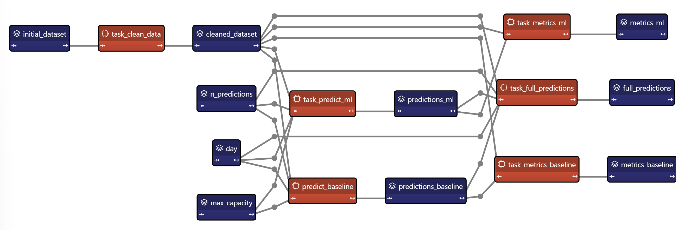

> You can download the full code [here](https://github.com/Avaiga/taipy-getting-started/tree/develop/src).

# Configuration of scenario

- Taipy Core efficiently manages the execution of your functions/pipelines.

- Taipy Core manages data sources and monitors KPIs.

- Taipy Core provides an easy management of multiple pipelines and end-user scenarios which comes in handy in the 
  context of Machine Learning or Mathematical optimization.

To apprehend the Scenario Management aspect of Taipy, you need to understand four essential concepts.

{ width=300 style="margin:auto;display:block" }

## Configuration [Basics](https://docs.taipy.io/en/latest/manuals/core/concepts/)

The configuration consists of defining Data Nodes and Tasks.

- [**Data Nodes**](https://docs.taipy.io/en/latest/manuals/core/concepts/data-node/): are the translation of variables in 
  Taipy. Data Nodes don't contain the data itself but know how to retrieve it. They can refer to any kind of data.

- [**Tasks**](https://docs.taipy.io/en/latest/manuals/core/concepts/task/): are the translation of functions in Taipy.

- [**Scenarios**](https://docs.taipy.io/en/latest/manuals/core/concepts/scenario/): Together, they create a graph that maps the execution flow which is called scenario. End-Users very often require modifying 
  various parameters to reflect different business situations. Taipy Scenarios will provide the framework to 
  "play"/"execute" pipelines under different conditions/variations (i.e. data/parameters modified by the end-user)

## Data Nodes Configuration
Data Nodes can point to various data sources, such as Python variables, CSV files, Pickle files, SQL databases, etc. During Data Node configuration, the developer specifies the type or format of each Data Node, along with its scope.

Parameters for Data Node configuration:

- Storage Type: Specifies the storage type for the Data Node, e.g., CSV file, Pickle file, etc. The initial dataset, for example, is a CSV file with storage_type="csv".

- Scope: Defines the scope of the Data Node. There are three types of scope in the code: Global, Scenario, and Pipeline scope.

1- `Scope.SCENARIO` (default): Having one data node for each scenario.

2- `Scope.CYCLE`: Extend the scope by sharing data nodes across all scenarios of a given cycle.

3- `Scope.GLOBAL`: Finally, extend the scope globally (across all scenarios of all cycles). For example, the initial/historical dataset is usually shared by all the scenarios/pipelines/cycles. It is unique in the entire application.


In a ML context, it is common to have numerous training and testing pipelines for different algorithms. Here, we configure two pipelines that predict on a given **day** the values for the following days either with ML or Baseline model:

- Retrieval of the initial dataset,

- Data Cleaning,

- Predictions (for *number of predictions*) from **day** onwards. In our example, predictions represents the number 
  of items sold in a given store on a 15-min basis.

- Creation of metrics and of a dataset for visualization.

-------------

### Input Data Nodes configuration
These are the input Data Nodes. They represent the variables in Taipy when a pipeline is executed. Still, first, we 
have to configure them to create the DAG.

- *initial_dataset* is simply the initial CSV file. Taipy needs some parameters to read this data: *path* and 
  *header*. The `scope` is global; each scenario or pipeline has the same initial dataset.

- *day* is the beginning of the predictions. The default value is the 26th of July. It means the training data will 
  end before the 26th of July, and predictions will begin on this day.

- *n_predictions* is the number of predictions you want to make while predicting. The default value is 40. A 
  prediction represents the number of items sold in a given store per 15-minute time slot.

- *max_capacity* is the maximum value that can take a prediction; it is the ceiling of the projections. The default  value is 200. It means that, in our example, the maximum number of items sold per 15 minutes is 200.

```python
import datetime as dt
import pandas as pd

from taipy import Config, Scope

## Input Data Nodes
initial_dataset_cfg = Config.configure_data_node(id="initial_dataset",
                                                 storage_type="csv",
                                                 path=path_to_csv,
                                                 scope=Scope.GLOBAL)

# We assume the current day is the 26th of July 2021.
# This day can be changed to simulate multiple executions of scenarios on different days
day_cfg = Config.configure_data_node(id="day", default_data=dt.datetime(2021, 7, 26))

n_predictions_cfg = Config.configure_data_node(id="n_predictions", default_data=40)

max_capacity_cfg = Config.configure_data_node(id="max_capacity", default_data=200)

```

### Remaining Data Nodes

- *cleaned_dataset* is the dataset after cleaning (after the `clean_data()` function).

- *predictions* are the predictions of the model. In this pipeline, it will be the output of the `predict_baseline()` 
  function. Each pipeline will create its own *prediction* Data Node hence `scope=Scope.PIPELINE`.

```python
## Remaining Data Nodes
cleaned_dataset_cfg = Config.configure_data_node(id="cleaned_dataset",
                                                 scope=Scope.GLOBAL) 

predictions_cfg = Config.configure_data_node(id="predictions")
```

## Task Configuration

Tasks are the translation of functions in Taipy. Each task has an ID, a function, inputs, and outputs.


### clean_data_task

The first task that you want to create is your `clean_data()` task. It will take your initial dataset (input Data Node), clean it (calling the `clean_data()` function) and generate the cleaned dataset Data Node. This task will only execute once thanks to the skippability feature of Taipy.

{ width=300 style="margin:auto;display:block" }

```python
clean_data_task_cfg = Config.configure_task(id="clean_data",
                                            function=clean_data,
                                            input=initial_dataset_cfg,
                                            output=cleaned_dataset_cfg,
                                            skippable=True)
```

### predict_baseline_task

This task will take the cleaned dataset and predict it according to your parameters i.e. the three input Data Nodes:

*Day*, *Number of predictions* and *Max Capacity*.

{ width=300 style="margin:auto;display:block" }

```python
predict_baseline_task_cfg = Config.configure_task(id="predict_baseline",
                                                  function=predict_baseline,
                                                  input=[cleaned_dataset_cfg, n_predictions_cfg, day_cfg, max_capacity_cfg],
                                                  output=predictions_cfg)
```

...

## Scenario configuration

```python
scenario_cfg = Config.configure_scenario_from_tasks(id="scenario",
                                                    task_configs=[clean_data_task_cfg,
                                                                  predict_baseline_task_cfg,
                                                                  predict_ml_task_cfg,
                                                                  metrics_baseline_task_cfg,
                                                                  metrics_ml_task_cfg,
                                                                  full_predictions_task_cfg],
                                                    frequency=Frequency.WEEKLY)

```

## Entire code (config/config.py)

```python
import datetime as dt
import pandas as pd

from taipy import Config, Scope, Frequency

from algos.algos import *

path_to_csv = "data/dataset.csv"

# Datanodes (3.1)
## Input Data Nodes
initial_dataset_cfg = Config.configure_data_node(id="initial_dataset",
                                                 storage_type="csv",
                                                 path=path_to_csv,
                                                 scope=Scope.GLOBAL)

# We assume the current day is the 26th of July 2021.
# This day can be changed to simulate multiple executions of scenarios on different days
day_cfg = Config.configure_data_node(id="day", default_data=dt.datetime(2021, 7, 26))

n_predictions_cfg = Config.configure_data_node(id="n_predictions", default_data=40)

max_capacity_cfg = Config.configure_data_node(id="max_capacity", default_data=200)

## Remaining Data Nodes
cleaned_dataset_cfg = Config.configure_data_node(id="cleaned_dataset",
                                                 scope=Scope.GLOBAL)

predictions_baseline_cfg = Config.configure_data_node(id="predictions_baseline")
predictions_ml_cfg = Config.configure_data_node(id="predictions_ml")

full_predictions_cfg = Config.configure_data_node(id="full_predictions")

metrics_baseline_cfg = Config.configure_data_node(id="metrics_baseline")
metrics_ml_cfg = Config.configure_data_node(id="metrics_ml")

# Functions (3.2)

# Tasks (3.3)
clean_data_task_cfg = Config.configure_task(id="task_clean_data",
                                            function=clean_data,
                                            input=initial_dataset_cfg,
                                            output=cleaned_dataset_cfg,
                                            skippable=True)

predict_baseline_task_cfg = Config.configure_task(id="predict_baseline",
                                                  function=predict_baseline,
                                                  input=[cleaned_dataset_cfg, n_predictions_cfg, day_cfg,
                                                         max_capacity_cfg],
                                                  output=predictions_baseline_cfg)


# Create the task configuration of the predict_ml function.
## We use the same input and ouput as the previous predict_baseline task but we change the funtion
predict_ml_task_cfg = Config.configure_task(id="task_predict_ml",
                                            function=predict_ml,
                                            input=[cleaned_dataset_cfg,
                                                   n_predictions_cfg, day_cfg,
                                                   max_capacity_cfg],
                                            output=predictions_ml_cfg)


metrics_baseline_task_cfg = Config.configure_task(id="task_metrics_baseline",
                                            function=compute_metrics,
                                            input=[cleaned_dataset_cfg,
                                                   predictions_baseline_cfg],
                                            output=metrics_baseline_cfg)

metrics_ml_task_cfg = Config.configure_task(id="task_metrics_ml",
                                            function=compute_metrics,
                                            input=[cleaned_dataset_cfg,
                                                   predictions_ml_cfg],
                                            output=metrics_ml_cfg)

full_predictions_task_cfg = Config.configure_task(id="task_full_predictions",
                                            function=create_predictions_dataset,
                                            input=[predictions_baseline_cfg,
                                                   predictions_ml_cfg,
                                                  day_cfg,
                                                  n_predictions_cfg,
                                                  cleaned_dataset_cfg],
                                            output=full_predictions_cfg)


# Configure our scenario which is our business problem.
scenario_cfg = Config.configure_scenario_from_tasks(id="scenario",
                                                    task_configs=[clean_data_task_cfg,
                                                                  predict_baseline_task_cfg,
                                                                  predict_ml_task_cfg,
                                                                  metrics_baseline_task_cfg,
                                                                  metrics_ml_task_cfg,
                                                                  full_predictions_task_cfg],
                                                    frequency=Frequency.WEEKLY)

Config.export('config/config.toml')
```
