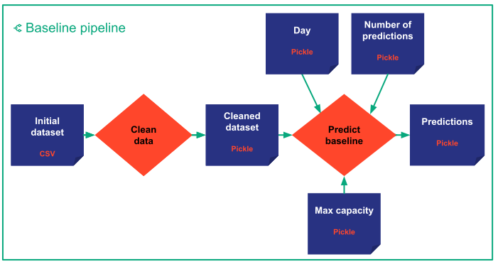
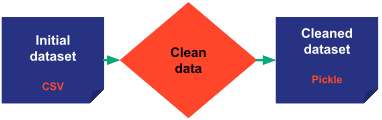
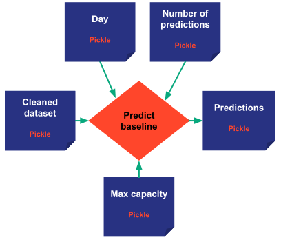

> You can download the code of this step [here](../src/step_03.py) or all the steps [here](https://github.com/Avaiga/taipy-getting-started/tree/develop/src).

!!! warning "For Notebooks"

    The "Getting Started" Notebook is available [here](https://docs.taipy.io/en/latest/getting_started/getting-started/getting_started.ipynb).

# Step 3: Introducing Taipy Core

From Step 2, you now know the basics of Taipy GUI. Let's go for a moment over the Scenario Management aspect of Taipy.

Even if Taipy GUI can be used without Taipy Core (and vice-versa), there are a lot of reasons for using Taipy Core:

- Taipy Core efficiently manages the execution of your functions/pipelines.

- Taipy Core manages data sources and monitors KPIs.

- Taipy Core provides an easy management of multiple pipelines and end-user scenarios which comes in handy in the 
  context of Machine Learning or Mathematical optimization.

To apprehend the Scenario Management aspect of Taipy, you need to understand four essential concepts.


## Four fundamental [concepts](https://docs.taipy.io/en/latest/manuals/core/concepts/) in Taipy Core:

- [**Data Nodes**](https://docs.taipy.io/en/latest/manuals/core/concepts/data-node/): are the translation of variables in 
  Taipy. Data Nodes don't contain the data itself but know how to retrieve it. They can refer to any kind of data: 
  any *Python* object (*string*, *int*, *list*, *dict*, *model*, *dataframe*, etc), a Pickle file, a CSV file, an 
  SQL database, etc. They know how to read and write data. You can even write your own custom Data Node if needed to 
  access a particular data format.

- [**Tasks**](https://docs.taipy.io/en/latest/manuals/core/concepts/task/): are the translation of functions in Taipy.

- [**Pipelines**](https://docs.taipy.io/en/latest/manuals/core/concepts/pipeline/): are a list of tasks executed with 
  intelligent scheduling created automatically by Taipy. They usually represent a sequence of Tasks/functions 
  corresponding to different algorithms like a simple baseline Algorithm or a more sophisticated Machine-Learning 
  pipeline.

- [**Scenarios**](https://docs.taipy.io/en/latest/manuals/core/concepts/scenario/): End-Users very often require modifying 
  various parameters to reflect different business situations. Taipy Scenarios will provide the framework to 
  "play"/"execute" pipelines under different conditions/variations (i.e. data/parameters modified by the end-user)


Let's create a Machine Learning (ML) example to clarify these concepts.

In a ML context, it is common to have numerous training and testing pipelines for different algorithms. For 
simplification, we will only configure a single baseline pipeline that will predict on a given **day** the values 
for the following days. In Taipy, you will describe (i.e. configure) your pipeline with three tasks:

- Retrieval of the initial dataset,

- Data Cleaning,

- Predictions (for *number of predictions*) from **day** onwards. In our example, predictions represents the number 
  of items sold in a given store on a 15-min basis.

{ width=500 style="margin:auto;display:block" }

This graph is created by configuring Data Nodes (variables) and tasks (functions). This configuration doesn't 
execute anything; it is just a configuration that enables Taipy to map the Tasks and Data Nodes as a Directed 
Acyclic Graph (DAG).

## Data Nodes configuration

Data Nodes can point to:

- any kind of *Python variables* by default: *int*, *string*, *dict*, *list*, *np.array*, *pd.DataFrame*, *models*, etc. 

- a CSV file, Pickle file or SQL database.

During the configuration of the Data Nodes, the developer specifies the type or format of each Data Node. A *Python* 
variable is stored by default by a Pickle file.

Some parameters for Data Node configuration:

- **Storage type**: This is where the storage type is selected: CSV file, SQL database, Pickle file, etc. Here, the initial dataset is a CSV file so *storage_type="csv"* for this Data Node. Taipy knows how to 
  access it, thanks to the path. By default, the storage type is *pickle*.

- **[Scope](https://docs.taipy.io/en/latest/manuals/core/concepts/scope/)**: You can find below three types of Scope in the 
  code: the Pipeline, the Scenario (by default) and the Global scope.

    - *Global scope*: all Data Nodes are shared between every pipelines, scenarios and cycles. For example, the 
      initial dataset is shared between every pipelines and scenarios.

    - *Scenario scope*: they are shared between all the pipelines of the scenario.

    - *Pipeline scope*: Data Nodes don't have access to other Data Nodes from other pipelines. A 'predictions' Data 
      Node is created for each pipeline in the current example. So, adding pipelines/algorithms will store 
      predictions in different "predictions" Data Nodes.

Important property for Tasks:
**Skippable**: This is a parameter used to increase the efficiency of the program. If the output Data Node has already been created and if its input/upstream data nodes haven’t changed since the last run (of the pipeline), then it is not necessary to rerun the task.


### Input Data Nodes configuration
These are the input Data Nodes. They represent the variables in Taipy when a pipeline is executed. Still, first, we 
have to configure them to create the DAG.

- *initial_dataset* is simply the initial CSV file. Taipy needs some parameters to read this data: *path* and 
  *header*. The `scope` is global; each scenario or pipeline has the same initial dataset.

- *day* is the beginning of the predictions. The default value is the 26th of July. It means the training data will 
  end before the 26th of July, and predictions will begin on this day.

- *n_predictions* is the number of predictions you want to make while predicting. The default value is 40. A 
  prediction represents the number of items sold in a given store per 15-minute time slot.

- *max_capacity* is the maximum value that can take a prediction; it is the ceiling of the projections. The default 
  value is 200. It means that, in our example, the maximum number of items sold per 15 minutes is 200.

```python
import datetime as dt
import pandas as pd

from taipy import Config, Scope

## Input Data Nodes
initial_dataset_cfg = Config.configure_data_node(id="initial_dataset",
                                                 storage_type="csv",
                                                 path=path_to_csv,
                                                 scope=Scope.GLOBAL)

# We assume the current day is the 26th of July 2021.
# This day can be changed to simulate multiple executions of scenarios on different days
day_cfg = Config.configure_data_node(id="day", default_data=dt.datetime(2021, 7, 26))

n_predictions_cfg = Config.configure_data_node(id="n_predictions", default_data=40)

max_capacity_cfg = Config.configure_data_node(id="max_capacity", default_data=200)

```

### Remaining Data Nodes

- *cleaned_dataset* is the dataset after cleaning (after the `clean_data()` function).
  with a `scope.GLOBAL`. It means if the initial dataset didn't change, Taipy will not re-execute the `clean_data()` 
  task. In other words, after the creation of this data node through `clean_data()`, Taipy knows that it is not 
  necessary to create it again.

- *predictions* are the predictions of the model. In this pipeline, it will be the output of the `predict_baseline()` 
  function. Each pipeline will create its own *prediction* Data Node hence `scope=Scope.PIPELINE`.

```python
## Remaining Data Nodes
cleaned_dataset_cfg = Config.configure_data_node(id="cleaned_dataset",
                                             validity_period=dt.timedelta(days=1),
                                             scope=Scope.GLOBAL) 

predictions_cfg = Config.configure_data_node(id="predictions", scope=Scope.PIPELINE)
```


## Functions

Here’s the code of each of the two *Python* functions: `clean_data()` and `predict_baseline()`. Their goal is 
respectively to clean the data and to predict the data.

```python
def clean_data(initial_dataset: pd.DataFrame):
    print("     Cleaning data")
    # Convert the date column to datetime
    initial_dataset["Date"] = pd.to_datetime(initial_dataset["Date"])
    cleaned_dataset = initial_dataset.copy()
    return cleaned_dataset


def predict_baseline(cleaned_dataset: pd.DataFrame, n_predictions: int, day: dt.datetime, max_capacity: int):
    print("     Predicting baseline")
    # Select the train data
    train_dataset = cleaned_dataset[cleaned_dataset["Date"] < day]
    
    predictions = train_dataset["Value"][-n_predictions:].reset_index(drop=True)
    predictions = predictions.apply(lambda x: min(x, max_capacity))
    return predictions
```

## Tasks

Tasks are the translation of functions in Taipy. These tasks combined with Data Nodes create your graph (DAG). 
Creating a task is simple; you need:

- An id

- A function

- Inputs

- Outputs

### clean_data_task

The first task that you want to create is your `clean_data()` task. It will take your initial dataset (input Data 
Node), clean it (calling the `clean_data()` function) and generate the cleaned dataset Data Node.

{ width=300 style="margin:auto;display:block" }

```python
clean_data_task_cfg = Config.configure_task(id="clean_data",
                                            function=clean_data,
                                            input=initial_dataset_cfg,
                                            output=cleaned_dataset_cfg,
                                            skippable=True)
```

### predict_baseline_task

This task will take the cleaned dataset and predict it according to your parameters i.e. the three input Data Nodes: 
*Day*, *Number of predictions* and *Max Capacity*.

{ width=300 style="margin:auto;display:block" }

```python
predict_baseline_task_cfg = Config.configure_task(id="predict_baseline",
                                                  function=predict_baseline,
                                                  input=[cleaned_dataset_cfg, n_predictions_cfg, day_cfg, max_capacity_cfg],
                                                  output=predictions_cfg)
```
