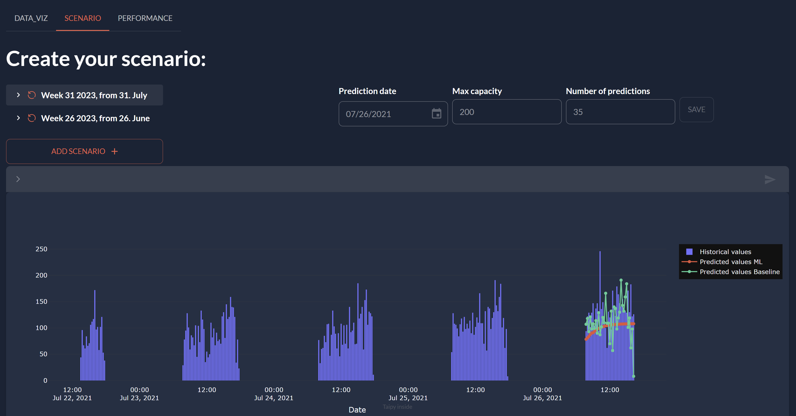

> You can download the full code [here](https://github.com/Avaiga/taipy-getting-started/tree/develop/src).

# Step 4: Scenario Page

The Scenario Page is a part of the application designed to create and customize scenarios for predictions based on time series data. Users can set different parameters for the prediction process, such as the prediction date, maximum capacity, and the number of predictions. The page also includes a chart that displays historical values and predictions made using machine learning and baseline methods.

{ width=700 style="margin:auto;display:block;border: 4px solid rgb(210,210,210);border-radius:7px" }"

The Scenario Page is constructed using a combination of Markdown and Python code. Below is a detailed explanation of each component:

## Markdown (pages/scenario/scenario.md)

```markdown
# Create your scenario:

<|layout|columns=3 1 1 1 1|
<|{scenario}|scenario_selector|>

**Prediction date** <br/>
<|{day}|date|active={scenario}|not with_time|>

**Max capacity** <br/>
<|{max_capacity}|number|active={scenario}|>

**Number of predictions** <br/>
<|{n_predictions}|number|active={scenario}|>

<br/> <|Save|button|on_action=save|active={scenario}|>
|>
 
<|{scenario}|scenario|>

<|{predictions_dataset}|chart|x=Date|y[1]=Historical values|type[1]=bar|y[2]=Predicted values ML|y[3]=Predicted values Baseline|>
```

The Markdown section defines the layout and components of the Scenario Page. It contains the following elements:

- **Scenario Selector**: `<|{scenario}|scenario_selector|>`

A component (a dropdown) that allows users to select different scenarios. The selected scenario will affect the values of other components on the page.

- **Prediction Date**: `<|{day}|date|...|>`

A date picker where users can select the date for which they want to make predictions. The selected date will be used for both machine learning and baseline predictions.

- **Max Capacity**: `<|{max_capacity}|number|...|>`

A number input field where users can set the maximum capacity value. This value is used to cap the predictions if they exceed the specified maximum.

- **Number of Predictions**: `<|{n_predictions}|number|...|>`

A number input field where users can set the desired number of predictions to be made.

- **Save Button**: `<|Save|button|on_action=save|active={scenario}|>`

A button that triggers the "save" action when clicked. It is used to save the selected scenario and parameter values.

- **Scenario Section**: `<|{scenario}|scenario|>`

A section that displays information about the currently selected scenario. It includes details about the scenario, properties, and the ability to delete or submit the scenario.

- **Predictions Chart**: `<|{predictions_dataset}|chart|...|>`

A chart that displays historical values and the predicted values obtained from machine learning and baseline methods. It shows how well the predictions align with the historical data.


## Python Code (pages/scenario/scenario.py)

The Python code initializes and manages the state of the Scenario Page.

```python
from taipy.gui import Markdown, notify
import datetime as dt
import pandas as pd


scenario = None
day = dt.datetime(2021, 7, 26)
n_predictions = 40
max_capacity = 200
predictions_dataset = {"Date":[0], 
                       "Predicted values ML":[0],
                       "Predicted values Baseline":[0],
                       "Historical values":[0]}


def save(state):
    print("Saving scenario...")
    # Get the currently selected scenario

    # Conversion to the right format
    state_day = dt.datetime(state.day.year, state.day.month, state.day.day)

    # Change the default parameters by writing in the Data Nodes
    state.scenario.day.write(state_day)
    state.scenario.n_predictions.write(int(state.n_predictions))
    state.scenario.max_capacity.write(int(state.max_capacity))
    notify(state, "success", "Saved!")
    

def on_change(state, var_name, var_value):
    if var_name == "scenario" and var_value:
        state.day = state.scenario.day.read()
        state.n_predictions = state.scenario.n_predictions.read()
        state.max_capacity = state.scenario.max_capacity.read()
        
        if state.scenario.full_predictions.is_ready_for_reading:
            state.predictions_dataset = state.scenario.full_predictions.read()
        else:
            state.predictions_dataset = predictions_dataset


scenario_page = Markdown("pages/scenario/scenario.md")
```


It includes the following components:

- **Global Variables**:

The global variables scenario, day, n_predictions, max_capacity, and predictions_dataset are defined. These variables store the initial state of the application.

- **Save Function**:

The save function is responsible for saving the current scenario state. When the user clicks the "Save" button, this function is called. It takes the state of the page as input, converts the date format to the appropriate format, and updates the scenario parameters accordingly. It then notifies the user with a success message.

- **On Change Function**:

The on_change function is called when any variable on the page changes its value. It monitors the changes in the scenario variable and updates the other variables accordingly. It also checks if the `full_predictions` are ready for reading and updates the `predictions_dataset` accordingly.

- **Scenario Page Initialization**:

The scenario_page variable is initialized as a Markdown object, representing the content of the Scenario Page.

It provides an interactive interface for users to create and customize different scenarios for time series predictions. It allows users to select prediction dates, set maximum capacity, and choose the number of predictions to make. The page also presents a chart to visualize the historical data and the predicted values from both machine learning and baseline methods. Users can save their selected scenarios to use them for further analysis and comparison. 

## Connection to the entire application

Don't forget to add the page to the application in the *main.py*:

Import `scenario_page` to the main file.

```python
...

def on_change(state, var_name: str, var_value):
    state['scenario'].on_change(state, var_name, var_value)

pages = {
    "/": root_page,
    "data_viz": data_viz,
    "scenario": scenario_page # add scenario
}

...
```