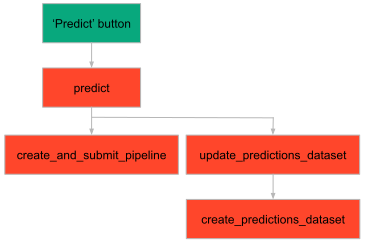
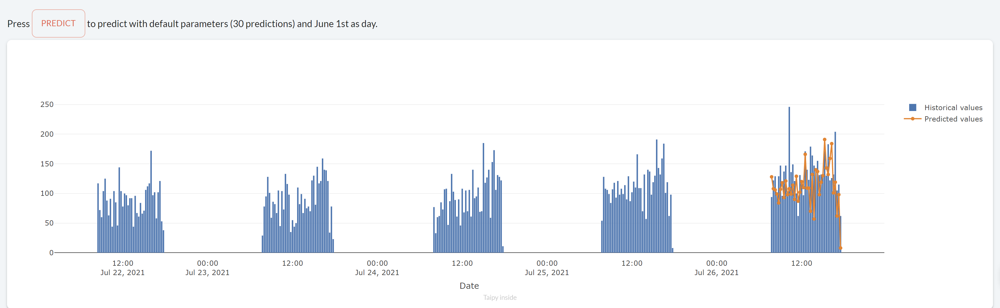

> You can download the code of this step [here](../src/step_05.py) or all the steps [here](https://github.com/Avaiga/taipy-getting-started/tree/develop/src).

!!! warning "For Notebooks"

    The "Getting Started" Notebook is available [here](https://docs.taipy.io/en/latest/getting_started/getting-started/getting_started.ipynb).

# Step 5: GUI and Pipeline

In Step 4, we created a first pipeline using only Taipy Core. Let's update the GUI to reflect the results of the 
pipeline.

A "Predict" [button](https://docs.taipy.io/en/latest/manuals/gui/viselements/button/) is added to the page to create the 
pipeline and run it. When you press a button, Taipy calls the function passed to the *on_action* property.

`<|Text displayed on button|button|on_action=fct_name_called_when_pressed|>`
   
A [chart](https://docs.taipy.io/en/latest/manuals/gui/viselements/chart/) control can be found at the end of the markdown to 
visualize the predictions. The chart plots two traces: the historical values and the predicted values.

```python
import numpy as np
import pandas as pd

# Initialize the "predictions" dataset
predictions_dataset = pd.DataFrame({"Date":[dt.datetime(2021, 6, 1)], "Historical values":[np.NaN], "Predicted values":[np.NaN]})

# Add a button and a chart for our predictions
pipeline_page = page + """
Press <|predict|button|on_action=predict|> to predict with default parameters (30 predictions) and June 1st as day.

<|{predictions_dataset}|chart|x=Date|y[1]=Historical values|type[1]=bar|y[2]=Predicted values|type[2]=scatter|height=80%|width=100%|>
"""
```

`create_and_submit_pipeline()` creates and executes the pipeline after being called by `predict()`. 

```python
def predict(state):
    print("'Predict' button clicked")
    pipeline = create_and_submit_pipeline()
    update_predictions_dataset(state, pipeline)


def create_and_submit_pipeline():
    print("Execution of pipeline...")
    # Create the pipeline from the pipeline config
    pipeline = tp.create_pipeline(baseline_pipeline_cfg)
    # Submit the pipeline (Execution)
    tp.submit(pipeline)
    return pipeline
```

After the execution of the pipeline (`tp.submit()`), the data stored in *predictions* and *cleaned_data* Data 
Nodes become accessible. The `read()` method accesses the data in Data Nodes.

The `create_predictions_dataset()` function below creates a final dataframe (that concatenates the predictions and 
the historical data together) containing three columns:

- Date,

- Historical values,

- Predicted values.

```python
def create_predictions_dataset(pipeline):
    print("Creating predictions dataset...")
    # Read data from the pipeline
    predictions = pipeline.predictions.read()
    day = pipeline.day.read()
    n_predictions = pipeline.n_predictions.read()
    cleaned_data = pipeline.cleaned_dataset.read()
    
    # Set arbitrarily the time window for the chart as 5 times the number of predictions
    window = 5 * n_predictions

    # Create the historical dataset that will be displayed
    new_length = len(cleaned_data[cleaned_data["Date"] < day]) + n_predictions
    temp_df = cleaned_data[:new_length]
    temp_df = temp_df[-window:].reset_index(drop=True)
    
    # Create the series that will be used in the concat
    historical_values = pd.Series(temp_df["Value"], name="Historical values")
    predicted_values = pd.Series([np.NaN]*len(temp_df), name="Predicted values")
    predicted_values[-len(predictions):] = predictions
    
    # Create the predictions dataset
    # Columns : [Date, Historical values, Predicted values]
    return pd.concat([temp_df["Date"], historical_values, predicted_values], axis=1)
```

It is now really simple to get  the predictions dataset and display it in the "Prediction chart" created above.


When you press the "Predict" button, this function below is called. It will update the predictions' dataset, and 
this change will propagate to the chart.


```python
def update_predictions_dataset(state, pipeline):
    print("Updating predictions dataset...")
    state.predictions_dataset = create_predictions_dataset(pipeline)
```

This is what the structure of the code looks like for the GUI:

{ width=500 style="margin:auto;display:block" }

```python
# Run of the Taipy Core service
tp.Core().run()

Gui(page=pipeline_page).run(dark_mode=False)
```

{ width=700 style="margin:auto;display:block;border: 4px solid rgb(210,210,210);border-radius:7px" }

> **Important Remark**: A better option would have been to have the `create_predictions_dataset()` modeled as a last **Task** inside the pipeline graph.
