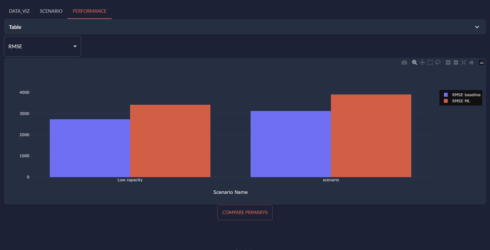

> You can download the code of this step [here](../src/step_05.py) or all the steps [here](https://github.com/Avaiga/taipy-getting-started/tree/develop/src).

# Building the GUI for a pipeline and buttons

Step 4 created a first pipeline using only Taipy Core, let's update the GUI to display the results of the pipeline.

A "Predict" [button](https://didactic-broccoli-7da2dfd5.pages.github.io/manuals/gui/viselements/button/) has been added to the page to create the pipeline and run it. When you press a button, Taipy calls the function in the *on_action* parameter.

`<|Text displayed on button|button|on_action=fct_name_called_when_pressed|>`
   
A [chart](https://didactic-broccoli-7da2dfd5.pages.github.io/manuals/gui/viselements/chart/) control can be found at the end of the markdown to see if the predictions seem correct. The chart creates two traces: the historical values and the predicted values.

```python
import numpy as np
import pandas as pd

# Initialize the 'predictions' dataset
predictions_dataset = pd.DataFrame({"Date":[dt.datetime(2021, 6, 1)], "Historical values":[np.NaN], "Predicted values":[np.NaN]})

# Add a button and a chart for our predictions
pipeline_page = page + """
Press <|predict|button|on_action=predict|> to predict with default parameters (30 predictions) and June 1st as day.

<|{predictions_dataset}|chart|type=bar|x=Date|y[1]=Historical values|y[2]=Predicted values|height=80%|width=100%|>
"""
```

`create_and_submit_pipeline` creates and executes the pipeline after being called by `predict`. 

```python
def predict(state):
    print("'Predict' button clicked")
    pipeline = create_and_submit_pipeline()
    update_predictions_dataset(state, pipeline)

def create_and_submit_pipeline():
    print("Execution of pipeline...")
    # Create the pipeline from the pipeline config
    pipeline = tp.create_pipeline(baseline_pipeline_cfg)
    # Submit the pipeline (Execution)
    tp.submit(pipeline)
    return pipeline
```

After the first submission of the pipeline, the data stored in *predictions* and *cleaned_data* Data Nodes become accessible. The `.read()` function accesses the data in Data Nodes.
By reading them, `create_predictions_dataset` creates a prediction dataset with these columns:

- Date,

- Historical values,

- Predicted values.

```python
def create_predictions_dataset(pipeline):
    print("Creating predictions dataset...")
    # Read data from the pipeline
    predictions = pipeline.predictions.read()
    day = pipeline.day.read()
    n_predictions = pipeline.n_predictions.read()
    cleaned_data = pipeline.cleaned_dataset.read()
    
    # Set the time window for the chart (5 days, 5 weeks, 5 months,...)
    window = 5 * n_predictions

    # Create the historical dataset that will be displayed
    new_length = len(cleaned_data[cleaned_data['Date'] < day]) + n_predictions
    temp_df = cleaned_data[:new_length]
    temp_df = temp_df[-window:].reset_index(drop=True)
    
    # Create the series that will be used in the concat
    historical_values = pd.Series(temp_df['Value'], name="Historical values")
    predicted_values = pd.Series([np.NaN]*len(temp_df), name="Predicted values") # change ? Fred
    predicted_values[-len(predictions):] = predictions
    
    # Create the predictions dataset
    # Columns : [Date, Historical values, Predicted values]
    return pd.concat([temp_df['Date'], historical_values, predicted_values], axis=1)
```

The goal is to make the predictions dataset and display it in a chart. However, a good option would have been to create this dataset directly in the pipeline. It is typically good to put all complexity in it.

When you press the 'Predict' button, this last function is also called. It will update the predictions dataset, and this change will propagate to the chart.

```python
def update_predictions_dataset(state, pipeline):
    print("Updating predictions dataset...")
    # Update the predictions dataset
    state.predictions_dataset = create_predictions_dataset(pipeline)
```

This is what the structure of the code looks like for the GUI:

{ align=center } 

```python
Gui(page=pipeline_page).run()
```

{ align=center } 