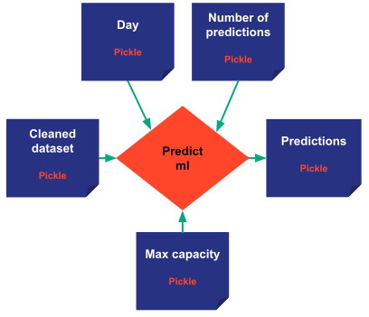

> You can download the code of this step [here](../src/step_06.py) or all the steps [here](https://github.com/Avaiga/taipy-getting-started/tree/develop/src).

!!! warning "For Notebooks"

    The "Getting Started" Notebook is available [here](https://docs.taipy.io/en/latest/getting_started/getting-started/getting_started.ipynb).

# Step 6: Creation of Scenarios

Now that you have seen how to create and run a single pipeline, let's configure a scenario. Remember, scenarios are 
required whenever the end-user wants to run variations of the pipelines and perform what-if analysis to simulate 
different business situations . Each scenario would represent a different solution to your problem. Here, 
*max_capacity*, *day* and *number of predictions* can influence the scenario.

In this example, we will run two pipelines: our initial  pipeline (*baseline*) together with a new one (referred as 
"*ml*") that will implement a  different prediction function/model.

```python
# For the sake of clarity, we have used an AutoRegressive model rather than a pure ML model such as:
# Random Forest, Linear Regression, LSTM, etc   
from statsmodels.tsa.ar_model import AutoReg

# This is the function that will be used by the task
def predict_ml(cleaned_dataset: pd.DataFrame, n_predictions: int, day: dt.datetime, max_capacity: int):
    print("     Predicting with ML")
    # Select the train data
    train_dataset = cleaned_dataset[cleaned_dataset["Date"] < day]
    
    # Fit the AutoRegressive model
    model = AutoReg(train_dataset["Value"], lags=7).fit()
    
    # Get the n_predictions forecasts
    predictions = model.forecast(n_predictions).reset_index(drop=True)
    predictions = predictions.apply(lambda x: min(x, max_capacity))
    return predictions
```

A **predict_ml** Task config will need to be created and associated with the newly created `predict_ml()` function.
The **predict_ml** Task configuration is created using the same format as before with a function, inputs, and outputs.

{ width=300 style="margin:auto;display:block" }

```python   
# Create the task configuration of the predict_ml function.
## We use the same input and ouput as the previous predict_baseline task but we change the funtion
predict_ml_task_cfg = Config.configure_task(id="predict_ml",
                                            function=predict_ml,
                                            input=[cleaned_dataset_cfg, n_predictions_cfg, day_cfg, max_capacity_cfg],
                                            output=predictions_cfg)
```

With this new task, the Machine Learning pipeline can finally be configured.

```python   
# Create the new ml pipeline that will clean and predict with the ml model
ml_pipeline_cfg = Config.configure_pipeline(id="ml", task_configs=[clean_data_task_cfg, predict_ml_task_cfg])
```

To configure a scenario, you need to use `tp.configure_scenario` and the list of the related pipelines. You can 
easily add more pipelines/algorithms if you wished to.

```python   
# Configure our scenario which is our business problem.
scenario_cfg = Config.configure_scenario(id="scenario", pipeline_configs=[baseline_pipeline_cfg, ml_pipeline_cfg])
```

The configuration is now complete. Now, you can create your scenario and execute it. When creating it, Taipy will 
create your pipelines (and its associated Tasks), and when you submit the scenario, it will run them based on 
Taipy’s built-in intelligent scheduling. Taipy knows in which sequence the Tasks need to be performed.

```python
# Run of the Taipy Core service
tp.Core().run()

# Create the scenario
scenario = tp.create_scenario(scenario_cfg)
# Execute it
tp.submit(scenario)
# Get the resulting scenario
## Print the predictions of the two pipelines (baseline and ml)
print("\nBaseline predictions\n", scenario.baseline.predictions.read())
print("\nMachine Learning predictions\n", scenario.ml.predictions.read())   
```
