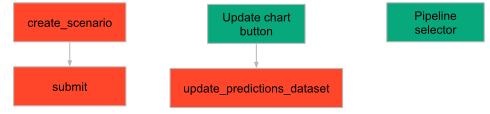
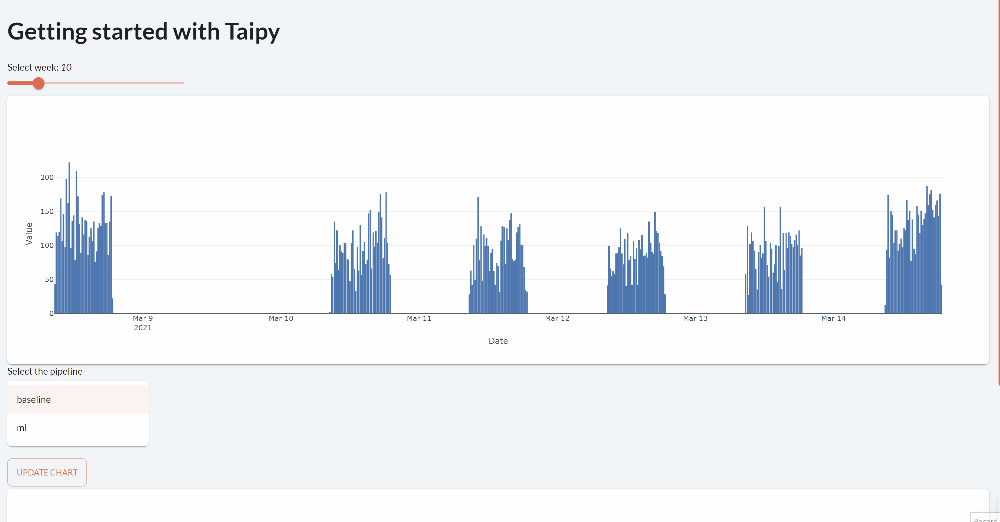

> You can download the code of this step [here](../src/step_07.py) or all the steps [here](https://github.com/Avaiga/taipy-getting-started/tree/develop/src).

!!! warning "For Notebooks"

    The "Getting Started" Notebook is available [here](https://docs.taipy.io/en/latest/getting_started/getting-started/getting_started.ipynb).

# Step 7: GUI and Scenario

In Step 6, using Taipy Core, we implemented a scenario configuration and created our first scenario (based on that 
config) . In this step, we will implement a graphical interface that makes use of scenarios. 

- First, a scenario will be created and executed at the beginning.

- Then, a Taipy GUI *selector* will be used to select one of the two pipelines associated with the scenario: the 
  *baseline* or the *ml* pipeline.

{ width=250 style="margin:auto;display:block" }

A [selector](https://docs.taipy.io/en/latest/manuals/gui/viselements/selector/) only needs two properties: a value that gets 
dynamically updated through the selector and the list of values possible (aka "lov"). Here is the syntax for a selector:

`<|{selected_value}|selector|lov={lov_selector}|>`.

An "Update chart" button will update the chart according to the selected pipeline.

These variables below are the parameters of the pipeline selector. The selected pipeline will be the first among 
"baseline" and "ml" when starting the client.

```python
# Set the list of pipelines names
# It will be used in a selector of pipelines
pipeline_selector = ["baseline", "ml"]
selected_pipeline = pipeline_selector[0]
```

This pipeline selector is added in the Markdown file just before the chart as well as the "Update chart" button.

```python
scenario_page = page + """
Select the pipeline
<|{selected_pipeline}|selector|lov={pipeline_selector}|> <|Update chart|button|on_action=update_chart|>

<|{predictions_dataset}|chart|x=Date|y[1]=Historical values|type[1]=bar|y[2]=Predicted values|type[2]=scatter|height=80%|width=100%|>
"""
```

The code around the GUI has evolved. `create_scenario()` is creating a scenario and submitting it with the 
`submit_scenario()` function. `update_chart()` is updating the chart based upon the selected scenario and pipeline.

{ width=500 style="margin:auto;display:block" }


```python
def create_scenario():
    print("Creating scenario...")
    scenario = tp.create_scenario(scenario_cfg)
    scenario = submit_scenario(scenario)
    return scenario

def submit_scenario(scenario):
    print("Submitting scenario...")
    tp.submit(scenario)
    return scenario

def update_chart(state):
    print("'Update chart' button clicked")
    # Select the right pipeline
    pipeline = scenario.pipelines[state.selected_pipeline]

    # Update the chart based on this pipeline
    # It is the same function as created before in step_5
    update_predictions_dataset(state, pipeline)
```

Before running the GUI, these two lines of code will erase the previous scenarios, pipelines, data nodes that you 
created in the previous steps to avoid any problem of compatibility.

```python
# Delete all entities
Config.configure_global_app(clean_entities_enabled=True)
tp.clean_all_entities()
```

```python
# Run of the Taipy Core service
tp.Core().run()

# Creation of our first scenario
scenario = create_scenario()
Gui(page=scenario_page).run(dark_mode=False) 
```

{ width=700 style="margin:auto;display:block;border: 2px solid rgb(210,210,210);border-radius:7px" }
