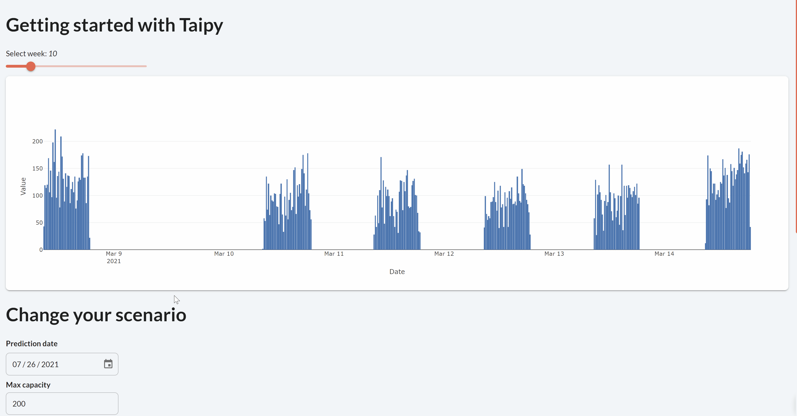

> You can download the code of this step [here](../src/step_08.py) or all the steps [here](https://github.com/Avaiga/taipy-getting-started/tree/develop/src).

!!! warning "For Notebooks"

    The "Getting Started" Notebook is available [here](https://docs.taipy.io/en/latest/getting_started/getting-started/getting_started.ipynb).

# Step 8: Modify Data Nodes content

Now that the GUI has been created to handle one scenario, it would be interesting to change the "initial" variables 
to see their impact on the predictions. These variables are: the *number of predictions*, the *max capacity* and the 
*day*. How can we interact with them in real-time?

It can easily be done using the `write()` function of Data Nodes.

First, to link these variables to a visual element, they have to be initialized. 
```python
# Initial variables
## Initial variables for the scenario   
day = dt.datetime(2021, 7, 26)
n_predictions = 40
max_capacity = 200
```

Second, we will add to the Markdown (before the chart), a visual element binding each of these variables. We will be 
using them to "modify" the scenario. See the documentation for these newly introduced visual elements here: 
[date](https://docs.taipy.io/en/latest/manuals/gui/viselements/date/) and 
[number](https://docs.taipy.io/en/latest/manuals/gui/viselements/number/). A "Save button" is also created to run the 
"submit_scenario()" function when pressed.

```python
page_scenario_manager = page + """
# Change your scenario

**Prediction date**\n\n <|{day}|date|not with_time|>

**Max capacity**\n\n <|{max_capacity}|number|>

**Number of predictions**\n\n<|{n_predictions}|number|>

<|Save changes|button|on_action={submit_scenario}|>

Select the pipeline
<|{selected_pipeline}|selector|lov={pipeline_selector}|> <|Update chart|button|on_action={update_chart}|>

<|{predictions_dataset}|chart|x=Date|y[1]=Historical values|type[1]=bar|y[2]=Predicted values|type[2]=scatter|height=80%|width=100%|>
"""
```

`create_scenario()` function is almost the same as before except for the need to track the *scenario_id* of the 
newly created scenario (using the Global variable *selected_scenario*).

```python
def create_scenario():
    global selected_scenario

    print("Creating scenario...")
    scenario = tp.create_scenario(scenario_cfg)
  
    selected_scenario = scenario.id
  
    tp.submit(scenario)
```

The `submit_scenario()` function introduces two essential Taipy functions:

- `tp.get(scenario_id)`: Taipy function used to get the scenario from its id.

- `write(new_value)`: a Data Node function that changes the value stored in the Data Node. For example, 
  *scenario.max_capacity* is a Data Node whose value can be changed to 100 like this
  `scenario.max_capacity.write(100)`.

```python
def submit_scenario(state):
    print("Submitting scenario...")
    # Get the selected scenario: in this current step a single scenario is created then modified here.
    scenario = tp.get(selected_scenario)
    
    # Conversion to the right format
    state_day = dt.datetime(state.day.year, state.day.month, state.day.day)

    # Change the default parameters by writing in the datanodes
    scenario.day.write(state_day)
    scenario.n_predictions.write(int(state.n_predictions))
    scenario.max_capacity.write(int(state.max_capacity))

    # Execute the pipelines/code
    tp.submit(scenario)
    
    # Update the chart when we change the scenario
    update_chart(state)
```

`update_chart()` uses a previous function (`update_predictions_dataset()`) to update the *predictions_dataset* 
with the correct pipeline.

```python
def update_chart(state):
    # Select the right scenario and pipeline
    scenario = tp.get(selected_scenario)
    pipeline = scenario.pipelines[state.selected_pipeline]
    # Update the chart based on this pipeline
    update_predictions_dataset(state, pipeline)


global selected_scenario

# Run of the Taipy Core service
tp.Core().run()

# Creation of a single scenario
create_scenario()
Gui(page=page_scenario_manager).run(dark_mode=False)
```

{ width=700 style="margin:auto;display:block;border: 4px solid rgb(210,210,210);border-radius:7px" }
