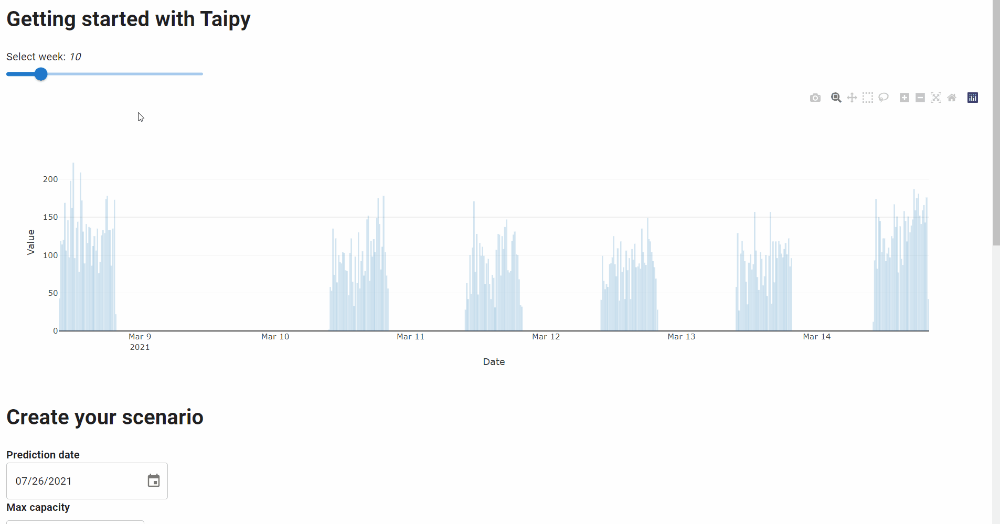

# GUI for mutli-scenarios

## Dynamic selectors

Let's manage multiple scenarios through a dynamic scenario selector. This selector will be updated whenever a new scenario is created. It will store the 'id' of the scenarios and their names. Only the names will be displayed in the selector.

This code initializes the scenario selector with the already created scenarios. If there are no scenarios, the selector will be empty.
```python
# Get all the scenarios already created
all_scenarios = tp.get_scenarios() 

# Initial variable for the scenario selector
# The value of selector will be the ids and what is display will be the name of the scenario
scenario_selector = [(scenario.id, scenario.name) for scenario in all_scenarios]
selected_scenario = None
```

A new selector for the scenario is added to the Markdown with a 'Create new scenario' button. This button is calling the `create_scenario` function.

```python
scenario_manager_page = page + """
# Create your scenario

**Prediction date**\n\n <|{day}|date|not with_time|>

**Max capacity**\n\n <|{max_capacity}|number|>

**Number of predictions**\n\n<|{n_predictions}|number|>

<|Create new scenario|button|on_action=create_scenario|>

## Scenario 
<|{selected_scenario}|selector|lov={scenario_selector}|dropdown|>

## Display the pipeline
<|{selected_pipeline}|selector|lov={pipeline_selector}|>

<|{predictions_dataset}|chart|type=bar|x=Date|y[1]=Historical values|y[2]=Predicted values|height=80%|width=100%|>
"""
```

The main code managing scenarios is here. As you can see, the architecture doesn't change from the previous code. Two functions have been altered with some addition: `create_scenario` and `submit_scenario`. 

```python
def create_name_for_scenario(state)->str:
    name = f"Scenario ({state.day.strftime('%A, %d %b')}; {state.max_capacity}; {state.n_predictions})"
    
    # Change the name if it is the same as some scenario's
    if name in [s[1] for s in state.scenario_selector]:
        name += f" ({len(state.scenario_selector)})"
    return name


# Change the create_scenario function in order to change the default parameters
# and allow the creation of multiple scenarios
def create_scenario(state):
    print("Execution of scenario...")
    # Extra information for the scenario
    creation_date = state.day
    name = create_name_for_scenario(state)
    # Create a scenario
    scenario = tp.create_scenario(scenario_cfg,creation_date=creation_date, name=name)
    
    state.selected_scenario = (scenario.id, name)
    # Submit the scenario that is currently selected
    submit_scenario(state)

def submit_scenario(state):
    print("Submitting scenario...")
    # Get the currently selected scenario
    scenario = tp.get(state.selected_scenario[0])
    
    # Conversion to the right format (change?)
    day = dt.datetime(state.day.year, state.day.month, state.day.day) 

    # Change the default parameters by writing in the Data Nodes
    #if state.day != scenario.day.read():
    scenario.day.write(day)
    #if int(state.n_predictions) != scenario.n_predictions.read(): 
    scenario.n_predictions.write(int(state.n_predictions))
    #if state.max_capacity != scenario.max_capacity.read():
    scenario.max_capacity.write(int(state.max_capacity))
    #if state.day != scenario.creation_date:
    scenario.creation_date = state.day
        

    # Execute the scenario
    tp.submit(scenario)
    
    # Update the scenario selector and the scenario that is currently selected
    update_scenario_selector(state, scenario) # change list to scenario
    
    # Update the chart directly
    update_chart(state) 
```

The function below will update the scenario selector whenever the user creates a new scenario. It is called in the `submit_scenario` function.

```python
def update_scenario_selector(state, scenario):
    print("Updating scenario selector...")
    # Update the scenario selector
    state.scenario_selector += [(scenario.id, scenario.name)]
```

This graph summarizes the code for the GUI.

<p align="center">
    
</p>


## Automatize the graph update - *on_change* function

The `on_change` function can automatically change the graph when another pipeline or scenario is selected.

```python
def on_change(state, var_name: str, var_value):
    if var_name == 'n_week':
        # Update the dataset when the slider is moved
        state.dataset_week = dataset[dataset['Date'].dt.isocalendar().week == var_value]
        
    elif var_name == 'selected_pipeline' or var_name == 'selected_scenario':
        # Update the chart when the scenario or the pipeline is changed
        # Check if we can read the Data Node to update the chart
        if tp.get(state.selected_scenario[0]).predictions.read() is not None:
            update_chart(state)
```

Run the Gui.

```python
Gui(page=scenario_manager_page).run()
```

<p align="center">
    
</p>
