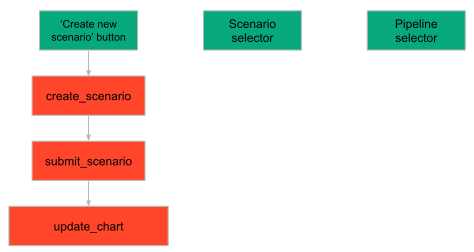

> You can download the code of this step [here](../src/step_09.py) or all the steps [here](https://github.com/Avaiga/taipy-getting-started/tree/develop/src).

!!! warning "For Notebooks"

    The "Getting Started" Notebook is available [here](https://docs.taipy.io/en/latest/getting_started/getting-started/getting_started.ipynb).

# Step 9: Manage Scenarios

Now that you know how to create a scenario, submit it and change it, you will create in this step a Taipy program 
able to manage multiple scenarios (and pipelines).

## Dynamic selectors

Let's manage multiple scenarios through a dynamic scenario selector. This selector will be updated whenever a new scenario is created. The _adapter_ property of selectors transforms the _selector_ lov from an Object to a visualizable object. In our use case, we have `adapter={lambda s: s.name}`. The selector shows scenario names while we manipulate Scenario objects in the code.

Beside adding to the Markdown the new scenario selector, we also add a new "Create new scenario" button. This button calls the `create_scenario()` function. So, now each time we modify the parameters (*day*, *max_capacity*, *n_prediction*) we will create a new scenario upon clicking on this "Create new scenario" button.

```python
scenario_manager_page = page + """
# Create your scenario

**Prediction date** <br/>
<|{day}|date|not with_time|>

**Max capacity**<br/>
<|{max_capacity}|number|>

**Number of predictions**<br/>
<|{n_predictions}|number|>

<|Create new scenario|button|on_action=create_scenario|>

## Scenario
<|{selected_scenario}|selector|lov={scenario_selector}|dropdown|adapter={lambda s: s.name}|>

## Display the pipeline
<|{selected_pipeline}|selector|lov={pipeline_selector}|>

<|{predictions_dataset}|chart|x=Date|y[1]=Historical values|type[1]=bar|y[2]=Predicted values|type[2]=scatter|>
"""
```

Here is the main code for managing scenarios. As you can see, the architecture doesn't change from the previous code.
Two functions have been altered: `create_scenario()` and `submit_scenario()`. 

```python
def create_name_for_scenario(state) -> str:
    name = f"{state.day.strftime('%a %d %b')}; {state.max_capacity}; {state.n_predictions}"

    # Change the name if it is the same as some scenarios
    if name in [s.name for s in state.scenario_selector]:
        name += f" ({len(state.scenario_selector)})"
    return name


# Change the create_scenario function in order to change the default parameters
# and allow the creation of multiple scenarios
def create_scenario(state):
    print("Execution of scenario...")
    # Extra information for the scenario
    creation_date = state.day
    name = create_name_for_scenario(state)
    # Create a scenario
    state.selected_scenario = tp.create_scenario(scenario_cfg, creation_date=creation_date, name=name)

    # Submit the scenario that is currently selected
    submit_scenario(state)


def submit_scenario(state):
    print("Submitting scenario...")

    # Conversion to the right format (change?)
    day = dt.datetime(state.day.year, state.day.month, state.day.day)

    # Change the default parameters by writing in the Data Nodes
    state.selected_scenario.day.write(day)
    state.selected_scenario.n_predictions.write(int(state.n_predictions))
    state.selected_scenario.max_capacity.write(int(state.max_capacity))
    state.selected_scenario.creation_date = state.day

    # Execute the scenario
    tp.submit(state.selected_scenario)

    # Update the scenario selector and the scenario that is currently selected
    state.scenario_selector += [scenario]

    # Update the chart directly
    update_chart(state)


    
def update_chart(state):
    # Now, the selected_scenario comes from the state, it is interactive
    pipeline = state.selected_scenario.pipelines[state.selected_pipeline]
    update_predictions_dataset(state, pipeline)
```

This graph summarizes the code for the GUI.

{ width=500 style="margin:auto;display:block" }


## Automating the graph update - *on_change* function

The `on_change` function can automatically change the graph when another pipeline or scenario is selected.

```python
def on_change(state, var_name: str, var_value):
    if var_name == "n_week":
        # Update the dataset when the slider is moved
        state.dataset_week = dataset[dataset["Date"].dt.isocalendar().week == var_value]
        
    elif var_name == "selected_pipeline" or var_name == "selected_scenario":
        # Update the chart when the scenario or the pipeline is changed
        # Check if we can read the Data Node to update the chart
        if tp.get(state.selected_scenario[0]).predictions.read() is not None:
            update_chart(state)
```

This code initializes the scenario selector with previously created scenarios. If there are no scenarios yet, the scenario selector will be empty. Run the Core and GUI.

```python
# Run of the Taipy Core service
tp.Core().run()
scenario_selector = tp.get_scenarios()
selected_scenario = None
Gui(page=scenario_manager_page).run(dark_mode=False)
```

{ width=700 style="margin:auto;display:block;border: 4px solid rgb(210,210,210);border-radius:7px" }
