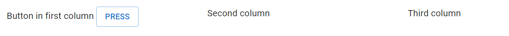
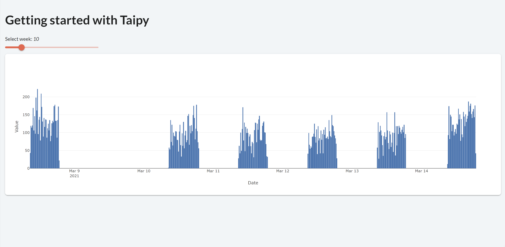
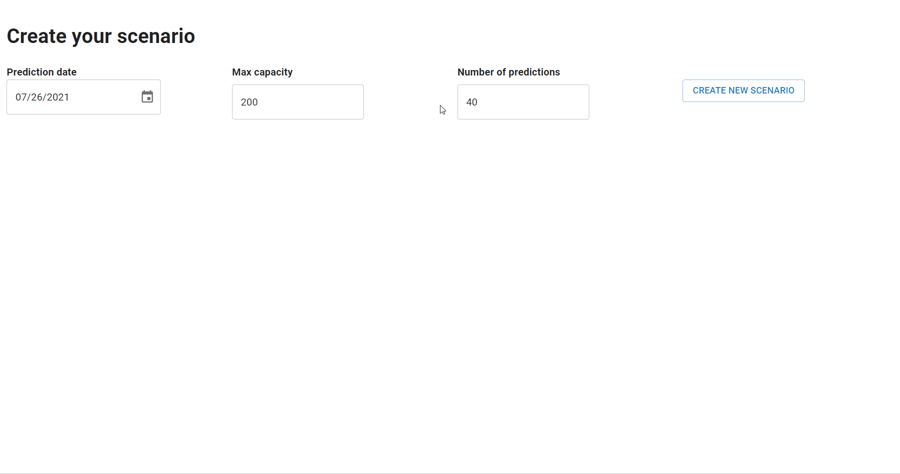
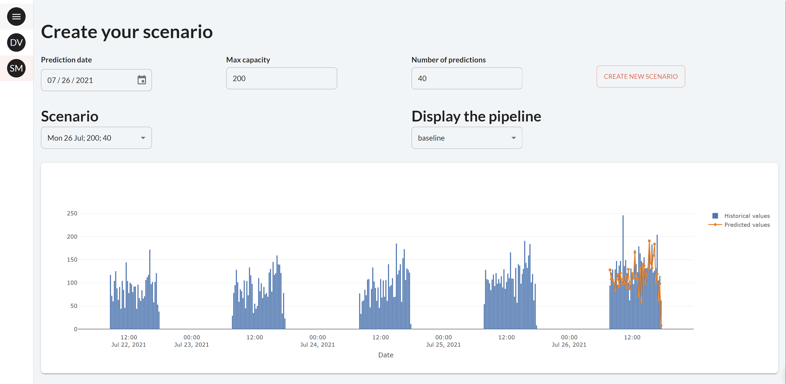

> You can download the code of this step [here](../src/step_10.py) or all the steps [here](https://github.com/Avaiga/taipy-getting-started/tree/develop/src).

!!! warning "For Notebooks"

    The "Getting Started" Notebook is available [here](https://docs.taipy.io/en/latest/getting_started/getting-started/getting_started.ipynb).

# Step 10: Embellish your App

With just a few steps, you have created a full forecasting application which predicts across multiple days with different parameters. However, the page's layout is not yet optimal and it could be greatly improved. This will be done during this step. To get a more aesthetically pleasing page, three new useful controls will be used. These are:

- [menu](https://docs.taipy.io/en/latest/manuals/gui/viselements/menu/): creates a menu on the left to navigate through the pages.

`<|menu|label=Menu|lov={lov_pages}|on_action=on_menu|>`. For example, this code creates a menu with two pages:

```python
from taipy.gui import Gui, navigate

def on_menu(state, var_name: str, fct: str, var_value: list):
    # the selected page is retrieved
    page = var_value["args"][0]
    navigate(state, page)

# The first element is the real name of the page
# The second one is the one displayed
lov_menu = [("Data-Visualization", "Data Visualization"),
            ("Scenario-Manager", "Scenario Manager")]

pages = {"/":"<|menu|label=Menu|lov={lov_menu}|on_action=on_menu|>",
         "Data-Visualization":"# Data Visualization page",
         "Scenario-Manager":"# Scenario Manager page"}

Gui(pages=pages).run()
```

{ width=50 style="margin:auto;display:block" }


- [part](https://docs.taipy.io/en/latest/manuals/gui/viselements/part/): creates a group of text/visual elements. A useful property of `part` is _render_. If set to False, it will not display the part. This allows the developer to dynamically display a group of visual elements or not.

```
<|part|render={bool_variable}|
Text
Or visual elements...
|>
```

- [layout](https://docs.taipy.io/en/latest/manuals/gui/viselements/layout/): creates invisible columns where you can put your texts and visual elements. The _columns_ property indicates the width and number of columns. Here, we create three columns of the same width.

```
<|layout|columns=1 1 1|
Button in first column <|Press|button|>

Second column

Third column
|>
```

{ width=500 style="margin:auto;display:block;border: 4px solid rgb(210,210,210);border-radius:7px" }


One strategy to switch from one page to another is:

1. To create a specific Markdown string for each page;

2. Use the Menu control to switch from one page to another with the `navigate()` function.

This is how you can easily create multiple pages; there are many other ways to do so.
 
First, let’s start by creating the 2 pages.

The first page contains the original chart and slider defined in Step 2. Let’s use the same Markdown as the one defined in Step 2. It is named _page_ (and is also present in Step 9). 


```python
# Our first page is the original page
# (with the slider and the chart that displays a week of the historical data)
page_data_visualization = page
```

{ width=700 style="margin:auto;display:block;border: 4px solid rgb(210,210,210);border-radius:7px" }


Then let’s create our second page which contains the page corresponding to the creation of scenarios seen in Step 9.

```python
# Second page: create scenarios and display results
page_scenario_manager = """
# Create your scenario

<|layout|columns=1 1 1 1|
<|
**Prediction date**\n\n <|{day}|date|not with_time|>
|>

<|
**Max capacity**\n\n <|{max_capacity}|number|>
|>

<|
**Number of predictions**\n\n<|{n_predictions}|number|>
|>

<|
<br/>\n <|Create new scenario|button|on_action=create_scenario|>
|>
|>

<|part|render={len(scenario_selector) > 0}|
<|layout|columns=1 1|
<|
## Scenario \n <|{selected_scenario}|selector|lov={scenario_selector}|dropdown|>
|>

<|
## Display the pipeline \n <|{selected_pipeline}|selector|lov={pipeline_selector}|dropdown|>
|>
|>

<|{predictions_dataset}|chart|x=Date|y[1]=Historical values|type[1]=bar|y[2]=Predicted values|type[2]=scatter|height=80%|width=100%|>
|>
"""
```

{ width=700 style="margin:auto;display:block;border: 4px solid rgb(210,210,210);border-radius:7px" }


The menu combines these two pages. When a page is selected in the menu control, `menu_fct()` is called and updates the page.

```python
lov_menu = [("Data-Visualization", "Data Visualization"),
            ("Scenario-Manager", "Scenario Manager")]

# Create a menu with our pages
root_md = "<|menu|label=Menu|lov={lov_menu}|on_action=menu_fct|>"

pages = {"/":root_md,
         "Data-Visualization":page_data_visualization,
         "Scenario-Manager":page_scenario_manager}


def menu_fct(state, var_name: str, fct: str, var_value: list):
    # The 'navigate' function is the one changing the page
    # It is a function present in taipy.gui
    navigate(state, var_value["args"][0])

# Run of the Taipy Core service
tp.Core().run()

Gui(pages=pages).run(dark_mode=False)
```

{ width=700 style="margin:auto;display:block;border: 4px solid rgb(210,210,210);border-radius:7px" }

