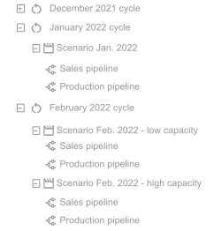

> You can download the code of this step [here](../src/step_11.py) or all the steps [here](https://github.com/Avaiga/taipy-getting-started/tree/develop/src).

!!! warning "For Notebooks"

    The "Getting Started" Notebook is available [here](https://docs.taipy.io/en/latest/getting_started/getting-started/getting_started.ipynb).

# Step 11: Introducing Cycles

So far, we have talked about how having different scenarios helps us to oversee our assumptions about the future. 
For example, in business, it is critical to weigh different options in order to come up with an optimal solution. 
However, this decision making process isn’t just a one-time task, but rather a recurrent operation that happens over 
a time period. This is why we want to introduce [Cycles](https://docs.taipy.io/en/latest/manuals/core/concepts/cycle/).

A cycle can be thought of as a place to store different and recurrent scenarios, within a time frame. In Taipy Core, 
each cycle will have a unique primary scenario, which represents the reference scenario for a time period.

{ width=300 style="margin:auto;display:block" }

Typically, in a Machine Learning problem, a lot of scenarios are created daily to predict the next day. Among all 
those scenarios, there is only one primary scenario. In the step's example, scenarios are attached to a DAILY cycle. 
Using Cycles is useful because some specific Taipy's functions exist to navigate through these Cycles. Taipy can get 
all the scenarios created in a day by providing the Cycle. You can also get every primary scenario ever made to 
quickly see their progress over time.

Moreover, nothing is more straightforward than creating a Cycle. The frequency parameter in a scenario configuration 
will create the desired type of Cycle. In the code below, the scenario has a daily cycle. It will be attached to the 
correct period (day) when it is created.

As you can see, a Cycle can be made very easily once you have the desired frequency. In this snippet of code, since 
we have specified `frequency=Frequency.DAILY`, the corresponding scenario will be automatically attached to the 
correct period (*day*) once it is created. 

```python
from taipy import Config, Frequency

# Create scenarios each week and compare them
scenario_daily_cfg = Config.configure_scenario(id="scenario",
                                           pipeline_configs=[baseline_pipeline_cfg, ml_pipeline_cfg],
                                           frequency=Frequency.DAILY)
```

To avoid any compatibility issue between scenarios with or without cycle, this code will erase the previous 
scenarios, pipelines, datanodes that you have maybe created in the previous steps.

```python
# Delete all entities
Config.configure_global_app(clean_entities_enabled=True)
tp.clean_all_entities()
```

To clarify this concept of primary scenario, the scenario selector will show a `*` before its name if the scenario 
is primary. This is why we update the following functions.

```python
# Change the inital scenario selector to see which scenarios are primary
scenario_selector = [(scenario.id, ("*" if scenario.is_primary else "") + scenario.name) for scenario in tp.get_scenarios()]

# Redefine update_scenario_selector to add "*" in the display name when the scnario is primary
def update_scenario_selector(state, scenario):
    print("Updating scenario selector...")
    # Create the scenario name for the scenario selector
    # This name changes dependind whether the scenario is primary or not
    scenario_name = ("*" if scenario.is_primary else "") + scenario.name
    print(scenario_name)
    # Update the scenario selector
    state.scenario_selector += [(scenario.id, scenario_name)]
```

In `create_scenario()`, *scenario_daily_cfg* is now the configuration used to create the scenario. By creating it, 
you also create the dependent Cycle. For example, setting `creation_date` to 04/02/2021 makes a cycle related to 
this day. All scenarios that are created on this day belong to this Cycle with just one primary scenario. Changing 
`creation_date` again will create another cycle for a different day and so on.

```python
# Change the create_scenario function to create a scenario with the selected frequency
def create_scenario(state):
    print("Execution of scenario...")
    # Extra information for scenario
    creation_date = state.day
    name = create_name_for_scenario(state)

    # Create a scenario with the week cycle
    scenario = tp.create_scenario(scenario_daily_cfg, creation_date=creation_date, name=name)

    state.selected_scenario = (scenario.id, name)

    # Change the scenario that is currently selected
    submit_scenario(state)
```

Two buttons are added to the GUI ("Make primary" and "Delete scenario"). They call the `make_primary()` and 
`delete_scenario()` functions below.

`make_primary()` changes the current primary scenario of the cycle thanks to `tp.set_primary(scenario)`. It is the 
Taipy function used to make a scenario primary.

> Note that the previous primary scenario will not longer be primary. There is always just one primary scenario in a cycle. 

```python
selected_scenario_is_primary = None

def make_primary(state):
    print("Making the current scenario primary...")
    scenario = tp.get(state.selected_scenario[0])
    # Take the current scenario primary
    tp.set_primary(scenario)
    
    # Update the scenario selector accordingly
    state.scenario_selector = [(scenario.id, ("*" if scenario.is_primary else "") + scenario.name)
                               for scenario in tp.get_scenarios()]
    state.selected_scenario_is_primary = True
```

This function is triggered by the "Delete scenario" button.

> Note that a primary scenario cannot be deleted.

```python
from taipy.gui import notify

def remove_scenario_from_selector(state, scenario: list):
    # Take all the scenarios in the selector that doesn't have the scenario.id
    state.scenario_selector = [(s[0], s[1]) for s in state.scenario_selector if s[0] != scenario.id]
    state.selected_scenario = state.scenario_selector[-1]

def delete_scenario(state):
    scenario = tp.get(state.selected_scenario[0])
    
    if scenario.is_primary:
        # Notify the user that primary scenarios can not be deleted
        notify(state, "info", "Cannot delete the primary scenario")
    else:
        # Delete the scenario and the related objects (datanodes, tasks, jobs,...)
        tp.delete(scenario.id)
        
        # Update the scenario selector accordingly
        remove_scenario_from_selector(state,scenario)
```

As previously said, just two visual elements ("Make primary" and "Delete scenario" buttons) have been added to the 
page. This code is almost identical to the previous *page_scenario_manager*.

```python
# Add a "Delete scenario" and a "Make primary" buttons
page_scenario_manager = """
# Create your scenario:

<|layout|columns=1 1 1 1|
<|
**Prediction date**\n\n <|{day}|date|not with_time|>
|>

<|
**Max capacity**\n\n <|{max_capacity}|number|>
|>

<|
**Number of predictions**\n\n<|{n_predictions}|number|>
|>

<|
<br/>
<br/>
<|Create new scenario|button|on_action=create_scenario|>
|>
|>


<|part|render={len(scenario_selector) > 0}|
<|layout|columns=1 1|

<|layout|columns=1 1|
<|
## Scenario \n <|{selected_scenario}|selector|lov={scenario_selector}|dropdown|>
|>

<br/>
<br/>
<br/>
<br/>
<|Delete scenario|button|on_action=delete_scenario|active={len(scenario_selector)>0}|>
<|Make primary|button|on_action=make_primary|active={not(selected_scenario_is_primary) and len(scenario_selector)>0}|>
|>


<|
## Display the pipeline \n <|{selected_pipeline}|selector|lov={pipeline_selector}|dropdown|>
|>
|>

<|{predictions_dataset}|chart|x=Date|y[1]=Historical values|type[1]=bar|y[2]=Predicted values|type[2]=scatter|height=80%|width=100%|>
|>
"""
```


```python
# Redefine the multi_pages
pages = {"/":root_md,
         "Data-Visualization":page_data_visualization,
         "Scenario-Manager":page_scenario_manager}
```

When the selected scenario is changed, Taipy calls the `on_change` and will update `state.
selected_scenario_is_primary` (set to `True` if the selected scenario is primary).

```python
def on_change(state, var_name: str, var_value):
    if var_name == "n_week":
        # Update the dataset when the slider is moved
        state.dataset_week = dataset[dataset["Date"].dt.isocalendar().week == var_value]
        
    elif var_name == "selected_pipeline" or var_name == "selected_scenario":
        # Update selected_scenario_is_primary indicating if the current scenario is primary or not
        state.selected_scenario_is_primary = tp.get(state.selected_scenario[0]).is_primary

        # Check if we can read the Data Node to update the chart
        if tp.get(state.selected_scenario[0]).predictions.read() is not None:
            update_chart(state)
```


```python
# Run of the Taipy Core service
tp.Core().run()

Gui(pages=pages).run(dark_mode=False)
```

{ style="margin:auto;display:block;border: 4px solid rgb(210,210,210);border-radius:7px" }
